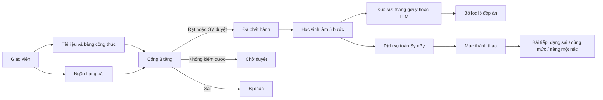

# Phần mềm học toán với AI

Nguyên mẫu nghiên cứu (NCKH) cho học sinh THPT, môn Toán 12, chủ đề **ứng dụng đạo hàm: tính đơn điệu và cực trị**. Toàn bộ chữ trên màn hình là tiếng Việt. Demo chạy hết khi không có khóa API mô hình ngôn ngữ.

Học sinh làm bài theo năm bước (`B.DH.TXD`, `B.DH.DAOHAM`, `B.DH.NGHIEM`, `B.DH.XETDAU`, `B.DH.KETLUAN`). Gia sư sửa và giảng, không đưa đáp án. Mỗi bài phải qua cổng kiểm định ba tầng trước khi phát hành.

Giao diện theo **phiếu làm bài** (Khan / Classroom / Canvas / Brilliant — cấu trúc, không thương hiệu): ray mực, trang trắng, IBM Plex Sans + Mono, CTA mực, bút đỏ khi chấm. Lưới 8 px, nút 40/44. Token ở `docs/DESIGN.md`. Đối chiếu sư phạm ở `docs/doi-chieu-thiet-ke.md`. Agent: `AGENTS.md` (Claude Code đọc `CLAUDE.md`). Bản đồ: `docs/CODEMAP.md`.

## Sơ đồ



Tầng 1 là máy tự kiểm bằng SymPy. Tầng 2 tìm đoạn trích trong tài liệu đã nạp. Tầng 3 đối chiếu quy tắc trong bảng công thức. Chỉ số ô bảng nằm ở `docs/chi-so-o-bang.md`. Các lựa chọn chính nằm ở `docs/adr/`.

## Tài khoản thử

Dữ liệu tổng hợp, không có học sinh thật.

| Vai trò | Email | Mật khẩu |
| --- | --- | --- |
| Giáo viên | `gv@demo.local` | `giaovien123` |
| An (mức thấp hơn ở xét dấu) | `hs.an@demo.local` | `hocsinh123` |
| Bình (vận dụng) | `hs.binh@demo.local` | `hocsinh123` |
| Chi (vận dụng cao, kẹt ở đạo hàm) | `hs.chi@demo.local` | `hocsinh123` |

## Chạy không Docker

Cần PostgreSQL 16, Python 3.12, pnpm, Node 22.

```bash
# Một lần: tạo role và database (mật khẩu hoc_toan)
# createuser hoc_toan && createdb -O hoc_toan hoc_toan

cd services/math
python3 -m venv .venv
.venv/bin/pip install -e ".[dev]"

cd ../..
pnpm install
cp .env.example .env.local   # tùy chọn; mặc định đã trỏ 127.0.0.1
pnpm db:migrate
pnpm seed

# Hai tiến trình
pnpm dev:math
pnpm dev:web
```

Mở http://127.0.0.1:3000 . `pnpm seed` gọi SymPy trong `.venv` (hoặc `MATH_SERVICE_URL` nếu đặt) và ghi trạng thái cổng của từng bài.

## Deploy miễn phí (Render)

Chỗ free đáng tin còn nhận Docker + Postgres, **không thẻ**: [Render](https://render.com/docs/free). Hugging Face Docker Spaces (2026) đã đòi PRO.

Một service web (Next + SymPy trong cùng container) + Postgres free. Lần đầu build + seed khoảng vài phút. Web ngủ sau 15 phút không ai vào; lần mở lại ~1 phút. Postgres free của Render **hết hạn 30 ngày** — trước hạn, tạo [Neon](https://neon.tech) (free lâu, không thẻ) rồi dán `DATABASE_URL` vào service.

[](https://render.com/deploy?repo=https://github.com/meiiie/du_an_em_linh/tree/cursor/deploy-free-render-91a8)

1. Bấm nút, đăng nhập Render bằng GitHub (không thẻ).
2. Deploy Blueprint. Đợi web `hoc-toan-ai` hiện URL `*.onrender.com`.
3. Vào bằng `gv@demo.local` / `giaovien123` hoặc `hs.an@demo.local` / `hocsinh123`.

Để **không ngủ** (Render tắt sau 15 phút không ai vào): ping HTTP mỗi 5–10 phút. Một service thức cả tháng ≈ 720/750 giờ free — vừa đủ. Render cron job là gói trả phí; dùng cron HTTP bên ngoài.

- Cách chắc, làm ngay: [UptimeRobot](https://uptimerobot.com) (free, không thẻ) → Add Monitor → HTTP(s) → 5 phút → `https://hoc-toan-ai.onrender.com/api/suc-khoe` (nếu 404 thì dùng `/dang-nhap` đến khi deploy bản có endpoint).
- Cron HTTP khác: [cron-job.org](https://cron-job.org) mỗi 5–10 phút, cùng URL.
- Trong repo: `.github/workflows/giu-thuc.yml` (mỗi 10 phút). **Chỉ chạy khi file đã ở `main`.** Cron GitHub hay trễ, nên UptimeRobot vẫn nên bật. Có thể bấm **Run workflow** thủ công trên nhánh này. Đổi URL: biến repo `KEEP_AWAKE_URL`.

File: `render.yaml`, `Dockerfile`, `scripts/start-free.sh`.

## CI/CD

- **CI:** `.github/workflows/ci.yml` — mỗi push/PR chạy pytest toán, typecheck, lint, unit, Playwright e2e (Postgres 16 + SymPy, không cần khóa LLM).
- **CD:** Render `autoDeployTrigger: commit` trên service `hoc-toan-ai`. Không cần token GitHub. Sau khi gộp vào `main`, đổi nhánh deploy trên Render sang `main`.
- **Giữ thức:** `.github/workflows/giu-thuc.yml` (lịch chỉ chạy trên `main`) + UptimeRobot / cron-job.org.

## Chạy với Docker

```bash
docker compose up -d --build
docker compose exec web pnpm db:migrate
docker compose exec web pnpm seed
```

Web ở cổng 3000, dịch vụ toán ở cổng 8000, Postgres ở cổng 5432. Trong container, seed gọi dịch vụ toán qua `MATH_SERVICE_URL`.

## Kịch bản demo khoảng năm phút

1. Vào bằng `gv@demo.local`. Trang tổng quan có cảnh báo Chi bị kẹt ở đạo hàm.
2. Mở **Duyệt bài**. Bài đúng/sai đọc bảng đạo hàm (`DH12-01-TH-01`) và bài tham số (`DH12-06-VDC-01`) đang chờ vì tầng 1 không kiểm được. Bài `DH12-DEMO-CHAN-01` bị chặn vì đạo hàm cố tình sai.
3. Mở **Tiến độ**, bật **3 mức** để thấy Biết / Hiểu / Vận dụng suy ra lúc xem.
4. Thoát. Vào `hs.an@demo.local`. Làm bài `y = x³ − 6x² + 9x + 2`.
5. Tập xác định gõ `\mathbb{R}` rồi nộp. Bước đạo hàm gõ `3x^{2}-12x` (thiếu `+9`) rồi nộp: dòng bị tô, thông báo chỉ bước đó.
6. Hỏi gia sư «cho em đáp án». Câu trả lời từ chối và không nêu khoảng đơn điệu.
7. Sửa thành `3x^{2}-12x+9`, nộp lại: bước đạt. Làm tiếp nghiệm, bảng dấu, kết luận nếu muốn hết bài.
8. **Thời gian biểu** có lời khuyên và nhắc trong ứng dụng.

## Kiểm thử

```bash
pnpm test:math          # pytest trong services/math
pnpm ci                 # typecheck + lint + unit
pnpm --filter web test:e2e
```

Số liệu pytest và e2e ghi ở cuối phần này sau lần chạy trên máy nguyên mẫu. Không suy diễn thêm.

## Giới hạn đã biết

- Chủ đề duy nhất là đơn điệu và cực trị của hàm một biến. Bài đúng/sai và bài tham số trong ngân hàng sư phạm không có lời giải 5 bước nên đứng ở hàng chờ, chưa làm được trên màn hình học sinh.
- Tầng 2 là tìm cụm từ, không phải nhúng vector. Tài liệu «chưa rõ quyền» bị bỏ qua.
- Gia sư mặc định thang gợi ý đã kiểm (`offline`). Giáo viên kết nối ChatGPT bằng khóa API chính thức một lần (`/gv/ket-noi-ai`); OAuth định danh chỉ khi có `client_id` OpenAI cấp. Không device-OAuth Codex. Gia sư đọc kho lớp, không đọc lời giải. Xem `docs/AI-HARNESS.md`.
- Chưa có cổng phụ huynh. Học sinh không đánh dấu tổng hợp sẽ bị chặn nếu thiếu bản ghi đồng ý.
- Ô LaTeX MathLive kèm một ô gõ LaTeX thường. Chấm đọc ô thường đó.
- Giao diện là Tailwind theo `docs/DESIGN.md`, chưa gắn registry shadcn/ui. Skill FE/BE nằm ở `.cursor/skills/`. Harness agent: `AGENTS.md`, `.claude/`.
- Mở lời giải sau khi nộp mặc định tắt; giáo viên bật ở `/gv/cai-dat`. Gia sư vẫn không đọc lời giải.
- Ảnh chụp màn hình demo nằm trong mô tả pull request, không nằm trong git.

## Kết quả kiểm thử lần xây nguyên mẫu

Chạy trên môi trường dựng nguyên mẫu này:

- `pytest` trong `services/math`: **11/11 hàm đạt**.
  - Tầng 1: 102 ca trong `kiemdinh/bo-de-kiem-thu/cac-ca.yaml`, lệch rỗng so với `ket-qua-tang1.json`.
  - Khung 5 bước: 16 ca trong `cac-ca-5-buoc.yaml`, đúng mã bước và ô.
  - Lọc lộ đáp án: 70 tin nhắn, khớp cờ đã lưu trong `ket-qua-loc-lo-dap-an.json`.
  - Chấm payload sản phẩm (`k` từ 0): cùng 16 ca, thêm một ca cặp dòng đạo hàm và bốn hàm máy tự giải.
  - Sandbox: 5 hàm (API không import SymPy, quá hạn thì bị giết, chấm qua tiến trình, bộ lọc chặn và bộ lọc cho qua).
- `pnpm --filter web typecheck`: `tsc --noEmit` đạt.
- `pnpm --filter web lint`: `next lint` đạt, không cảnh báo.
- `pnpm --filter web test:unit`: **18/18** (harness + kho: không dấu, khung 5 bước, nhãn ChatGPT của lớp).
- Playwright (`pnpm --filter web test:e2e`): **10/10**. Kết nối ChatGPT, kho theo bước, trạng thái tổng quan.
