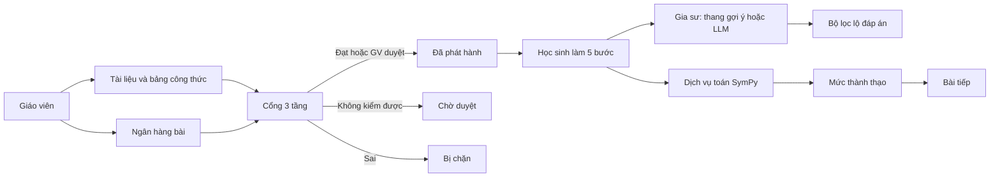

# Học toán với AI

[](https://github.com/meiiie/du_an_em_linh/actions/workflows/ci.yml)
[](https://github.com/meiiie/du_an_em_linh/releases)
[](LICENSE)
[](https://www.conventionalcommits.org/)

Nguyên mẫu NCKH: phần mềm học Toán THPT, **một** chủ đề Toán 12 — ứng dụng đạo hàm để xét đơn điệu và cực trị. Mọi chữ trên màn hình là tiếng Việt. Demo chạy hết khi không có khóa API mô hình ngôn ngữ.

**Bản thử:** [hoc-toan-ai.onrender.com](https://hoc-toan-ai.onrender.com) — trang chủ công khai; vào lớp ở `/dang-nhap`. Logo tab: `/favicon.ico` (ICO + PNG ≥48px cho Google Search).

Học sinh làm bài theo năm bước (`B.DH.TXD` → `B.DH.DAOHAM` → `B.DH.NGHIEM` → `B.DH.XETDAU` → `B.DH.KETLUAN`). Gia sư sửa và giảng, **không đưa đáp án**. Mỗi bài phải qua cổng kiểm định ba tầng trước khi phát hành.

## Tính năng

- Phiếu 5 bước + chấm SymPy; cổng `DAT` / `SAI` / `KHONG_KIEM_DUOC` + duyệt giáo viên
- Gia sư: luật xin đáp án → thang 3 cấp → kho lớp → nhà đã chọn → lọc lộ đáp án
- ChatGPT bằng khóa API chính thức một lần; Ollama / LM Studio chỉ loopback
- BKT gợi bài tiếp; 4 mức khi học, 3 mức CV 7991 lúc xem
- Đa thiết bị (điện thoại / máy tính bảng / máy tính)

## Sơ đồ



Tầng 1: SymPy. Tầng 2: đoạn trích tài liệu đã nạp. Tầng 3: bảng công thức. Quyết định đã khóa: `docs/adr/`.

## Tài khoản thử

Dữ liệu tổng hợp, không có học sinh thật.

| Vai trò | Email | Mật khẩu |
| --- | --- | --- |
| Giáo viên | `gv@demo.local` | `giaovien123` |
| An | `hs.an@demo.local` | `hocsinh123` |
| Bình | `hs.binh@demo.local` | `hocsinh123` |
| Chi | `hs.chi@demo.local` | `hocsinh123` |

## Chạy local

Cần PostgreSQL 16, Python 3.12, Node 22, pnpm.

```bash
cd services/math
python3 -m venv .venv
.venv/bin/pip install -e ".[dev]"
cd ../..

pnpm install
pnpm db:migrate
pnpm seed
pnpm dev:math   # một tiến trình
pnpm dev:web    # tiến trình khác → http://127.0.0.1:3000
```

Hoặc `docker compose up -d --build` rồi `docker compose exec web pnpm db:migrate && docker compose exec web pnpm seed`.

Biến môi trường: `.env.example`.

## Demo khoảng năm phút

1. Vào `gv@demo.local`. Tổng quan cảnh báo Chi kẹt ở đạo hàm.
2. **Duyệt bài:** `DH12-01-TH-01` chờ (không kiểm được), `DH12-DEMO-CHAN-01` bị chặn.
3. **Tiến độ** → bật **3 mức** (Biết / Hiểu / Vận dụng).
4. Vào `hs.an@demo.local`, bài `y = x³ − 6x² + 9x + 2`.
5. Tập xác định `\mathbb{R}`. Đạo hàm `3x^{2}-12x` (thiếu `+9`) → tô lỗi. Hỏi «cho em đáp án» → từ chối.
6. Sửa `3x^{2}-12x+9` → đạt.

## Kiểm thử

```bash
pnpm test:math
pnpm test:web              # typecheck + lint + unit
pnpm --filter web test:e2e
```

Số liệu lần dựng nguyên mẫu: [`docs/KIEM-THU.md`](docs/KIEM-THU.md). CI chạy cùng bộ lệnh trên mọi push/PR (`.github/workflows/ci.yml`).

## Deploy

Render free, không thẻ: một container Next + SymPy + Postgres. Chi tiết giữ thức, Neon, hạn 30 ngày: [`docs/TRIEN-KHAI.md`](docs/TRIEN-KHAI.md).

[](https://render.com/deploy?repo=https://github.com/meiiie/du_an_em_linh)

## Nhánh

GitHub Flow: **`main`** là mã phát hành. Mỗi việc một nhánh ngắn, một PR vào `main`. Không chồng PR. Xem [`CONTRIBUTING.md`](CONTRIBUTING.md).

**Phiên bản:** SemVer `0.1.0` (nguyên mẫu). Changelog: [`CHANGELOG.md`](CHANGELOG.md). Cách cắt bản: [`docs/PHIEN-BAN.md`](docs/PHIEN-BAN.md).

Chủ repo bật bảo vệ nhánh và mô tả repo: [`docs/GITHUB.md`](docs/GITHUB.md).

## Tài liệu

| Tài liệu | Nội dung |
| --- | --- |
| [`docs/product/MUC-TIEU.md`](docs/product/MUC-TIEU.md) | Mục tiêu sản phẩm (sơ đồ khách), đối chiếu nguyên mẫu, câu hỏi mở |
| [`docs/HIEN-CHUONG.md`](docs/HIEN-CHUONG.md) | Hiến chương kỹ thuật — nguyên tắc không thương lượng, cổng chất lượng |
| [`docs/QUY-TRINH.md`](docs/QUY-TRINH.md) | Quy trình người + agent + lab |
| [`labs/`](labs/README.md) | Lab thiết kế, sư phạm, kiểm định, nghiên cứu, quyết định |
| [`CHANGELOG.md`](CHANGELOG.md) | Nhật ký phiên bản |
| [`docs/PHIEN-BAN.md`](docs/PHIEN-BAN.md) | SemVer, Conventional Commits, release-please |
| [`CONTRIBUTING.md`](CONTRIBUTING.md) | Nhánh, PR, lệnh |
| [`SUPPORT.md`](SUPPORT.md) | Chỗ hỏi / mở issue |
| [`CODE_OF_CONDUCT.md`](CODE_OF_CONDUCT.md) | Contributor Covenant 2.1 |
| [`docs/DESIGN.md`](docs/DESIGN.md) | Token, lưới 8 px, nút 40/44 |
| [`docs/AI-HARNESS.md`](docs/AI-HARNESS.md) | Nhà AI, không fallback, không lộ đáp án |
| [`docs/adr/`](docs/adr/) | Quyết định kiến trúc (ADR 011 — kiến trúc v2: Angular + Spring Boot + dịch vụ toán) |
| [`docs/product/LO-TRINH.md`](docs/product/LO-TRINH.md) | Lộ trình v2 theo pha, điều kiện xong từng pha |
| [`docs/CODEMAP.md`](docs/CODEMAP.md) | Bản đồ mã (cho agent) |
| [`AGENTS.md`](AGENTS.md) | Quy ước agent |

## Giới hạn

- Chỉ đơn điệu và cực trị hàm một biến. Bài đúng/sai và tham số không có lời giải 5 bước → hàng chờ.
- Tầng 2 tìm cụm từ, không nhúng vector. Tài liệu «chưa rõ quyền» bị bỏ.
- ChatGPT = khóa API chính thức; không device-OAuth Codex.
- Chưa có cổng phụ huynh. Chấm đọc ô LaTeX thường, không đọc MathLive.

## Giấy phép

[MIT](LICENSE). Ứng xử: [`CODE_OF_CONDUCT.md`](CODE_OF_CONDUCT.md). Hỗ trợ: [`SUPPORT.md`](SUPPORT.md). Lỗ hổng: [`SECURITY.md`](SECURITY.md).
