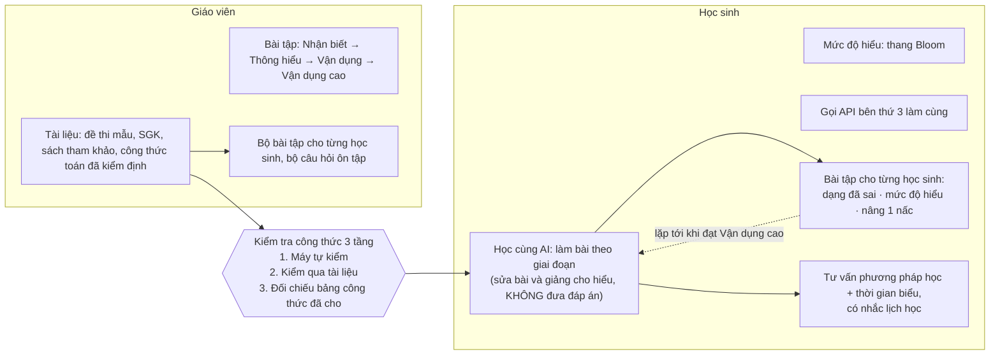

# Mục tiêu sản phẩm — đọc sơ đồ «Phần mềm học toán với AI»

> Tài liệu sống. Nguồn: sơ đồ khách hàng gửi (bản ảnh, nhận 2026-10-01). Phân tích: 2026-10-01.
> Đây là **nguồn chuẩn về phạm vi** cho bản v2. Thay đổi phạm vi → sửa file này trong PR riêng, chủ repo duyệt.

## 1. Sơ đồ, chép lại thành chữ

## 2. Năng lực sản phẩm suy ra từ sơ đồ

Mã `C*` dùng xuyên suốt issue, spec, ADR.

| Mã | Năng lực | Khối trên sơ đồ | Đầu ra cốt lõi |
| --- | --- | --- | --- |
| C1 | Kho tài liệu lớp: nạp đề mẫu, SGK, sách tham khảo; tách câu hỏi, công thức, trích dẫn được | GV · Tài liệu | Văn bản + công thức LaTeX có vị trí nguồn (tài liệu, trang) |
| C2 | Bảng công thức đã kiểm định: giáo viên khóa, có phiên bản | GV · «công thức đã kiểm định» | Bảng công thức có hash; đổi bảng → các lần kiểm cũ thành `stale` |
| C3 | Ngân hàng bài theo 4 mức NB → TH → VD → VDC, gắn kỹ năng và yêu cầu cần đạt (YCCĐ) CT GDPT 2018 | GV · Bài tập | Bài có mức, kỹ năng, dạng câu, lời giải ẩn |
| C4 | Bộ bài cho từng học sinh và bộ câu hỏi ôn tập (giáo viên duyệt, giao) | GV · ↓ | Bộ bài cá nhân, đề ôn theo định dạng thi |
| C5 | Cổng kiểm tra 3 tầng cho **mọi** nội dung toán đi tới học sinh | Mũi tên giữa | `DAT` / `SAI` / `KHONG_KIEM_DUOC` (+ `GV_DUYET`) kèm căn cứ |
| C6 | Mô hình mức hiểu của từng học sinh theo kỹ năng × mức (Bloom ↔ 4 mức) | HS · Mức độ hiểu | Xác suất thành thạo theo kỹ năng, mức đạt cao nhất |
| C7 | Học cùng AI theo giai đoạn: sửa bài, giảng cho hiểu, không đưa đáp án; mô hình AI bên thứ ba | HS · Học cùng AI + API | Lượt gia sư đã lọc, có trích dẫn, ghi vết |
| C8 | Bài tập cá nhân hóa: dạng đã sai (chữa lỗi), đúng mức hiện tại, nâng 1 nấc | HS · ↓ | Hàng đợi bài kế tiếp có lý do |
| C9 | Tư vấn phương pháp học + thời gian biểu + nhắc lịch | HS · → | Kế hoạch tuần, lời khuyên có căn cứ, nhắc đúng kênh |
| C10 | Vòng lặp thành thạo tới Vận dụng cao | Dải dưới cùng | Lộ trình mở khóa kỹ năng/mức tới VDC |

### Diễn giải các chỗ dễ hiểu sai

- **«Kiểm tra công thức 3 tầng» nằm trên mũi tên đi vào khối «Học cùng AI».** Nghĩa là cổng không chỉ chặn đề bài trước khi phát hành. Mọi công thức AI đưa ra trong lời giảng cũng phải qua 3 tầng: (1) máy kiểm bằng CAS, (2) có trong tài liệu đã nạp (trích dẫn được), (3) khớp bảng công thức giáo viên đã khóa. Đây là hàng rào chống mô hình bịa công thức, rủi ro số một của gia sư LLM môn toán.
- **«Mức độ hiểu: thang Bloom»** là thước đo nội bộ để định vị học sinh. Sơ đồ không nói phải hiện chữ «Bloom» cho học sinh. Nguyên mẫu v0 cố ý giấu Bloom khỏi mặt học sinh, cần khách xác nhận (Q3).
- **«Làm bài tập theo giai đoạn»** có hai cách đọc, cả hai đều cần: (a) theo **bước giải** trong một bài (nguyên mẫu v0 làm khung 5 bước), (b) theo **giai đoạn nhận thức** NB → TH → VD → VDC xuyên nhiều bài (khớp dải «tới khi nào học tới vận dụng cao»). Cần khách xác nhận trọng tâm (Q2).
- **«Nâng lên 1 nấc»** là nâng đúng một bậc độ khó hoặc mức nhận thức so với mức vừa đạt. Đây là vùng phát triển gần (Vygotsky) và «khó vừa đủ» (Bjork). Không nhảy mức.
- **«Gọi API bên thứ 3 làm cùng»** là gia sư chạy trên mô hình của nhà cung cấp ngoài (OpenAI / Anthropic / Google …), không tự huấn luyện mô hình. Hệ quả: dữ liệu học sinh **ra khỏi hệ thống**, nên phải xóa định danh và tuân Luật BVDLCN (mục 5).

## 3. Luồng đầu-cuối

| Luồng | Các bước | Năng lực |
| --- | --- | --- |
| A — Soạn và phát hành | GV nạp tài liệu → hệ thống tách câu/công thức → GV khóa bảng công thức → GV hoặc AI soạn bài theo 4 mức → cổng 3 tầng → `DAT` thì mở, `KHONG_KIEM_DUOC` chờ GV duyệt, `SAI` bị chặn | C1 C2 C3 C5 |
| B — Học một bài | HS mở bài kế tiếp → làm theo bước → máy chấm từng bước → sai thì gia sư hỏi gợi mở theo thang gợi ý (không bottom-out) → đạt → cập nhật mức hiểu | C5 C6 C7 |
| C — Cá nhân hóa | Sau mỗi bài: chọn bài kế (chữa dạng đã sai / củng cố đúng mức / nâng 1 nấc) → lặp tới VDC | C6 C8 C10 |
| D — Kế hoạch và nhắc | HS khai giờ rảnh và hạn thi → hệ thống lập thời gian biểu theo lỗ hổng và lặp cách quãng → nhắc lịch → điều chỉnh theo tiến độ thật | C9 |
| E — Giáo viên theo dõi | Bảng lớp theo kỹ năng × mức → học sinh kẹt được nêu → GV giao bộ bài / ôn tập → xem đủ lỗi của từng bài nộp | C4 C6 |

## 4. Thang mức độ — ánh xạ bắt buộc

Sơ đồ dùng **4 mức** của truyền thống ra đề Việt Nam. Văn bản hiện hành của Bộ dùng **3 mức**. Bloom (bản sửa đổi 2001) có 6 bậc. Hệ thống lưu 4 mức và Bloom trên mỗi bài, chỉ quy đổi sang 3 mức khi **hiển thị** cho giáo viên (giữ ADR 004 của v0).

| 4 mức (sơ đồ) | Bloom sửa đổi (Anderson & Krathwohl 2001) | 3 mức CV 7991/BGDĐT-GDTrH | Đề TN THPT môn Toán (từ 2025) |
| --- | --- | --- | --- |
| Nhận biết (NB) | Nhớ | Biết | Chủ yếu Phần I (12 câu nhiều lựa chọn) |
| Thông hiểu (TH) | Hiểu | Hiểu | Phần I, các ý đầu Phần II (4 câu × 4 ý đúng/sai) |
| Vận dụng (VD) | Vận dụng | Vận dụng | Phần II, Phần III (6 câu trả lời ngắn) |
| Vận dụng cao (VDC) | Phân tích · Đánh giá · Sáng tạo | Vận dụng (gộp) | Phần III, câu khó |

- CV 7991 (17/12/2024): đề định kỳ 3 mức theo tỉ lệ 40 % Biết, 30 % Hiểu, 30 % Vận dụng. Phần khách quan 7/10 điểm (tối đa 3 dạng: nhiều lựa chọn, đúng/sai, trả lời ngắn), tự luận 3/10.
- Đề thi tốt nghiệp THPT môn Toán: 22 câu, 90 phút, 3 phần như cột cuối.
- Hệ quả thiết kế: ngân hàng bài phải hỗ trợ **4 dạng câu**: nhiều lựa chọn, đúng/sai nhiều ý, trả lời ngắn (khóa định dạng số), tự luận theo bước. v0 mới có tự luận theo bước.

## 5. Bất biến (không thương lượng)

Mỗi bất biến có bằng chứng hoặc căn cứ pháp lý. Hiến chương [`docs/HIEN-CHUONG.md`](../HIEN-CHUONG.md) nâng các bất biến này thành nguyên tắc có cổng kiểm.

1. **Không đưa đáp án khi học sinh đang làm.** Gia sư hỏi gợi mở, chỉ chỗ sai và lý do, gợi ý theo thang, không bottom-out. Căn cứ: thử nghiệm thực địa gần 1.000 học sinh THPT môn toán, nhóm dùng GPT không rào chắn **giảm 17 % điểm** khi bị bỏ trợ giúp, nhóm có rào chắn kiểu gia sư thì gần như không bị hại (Bastani et al., *PNAS* 2025).
2. **Mọi công thức và kết quả toán tới học sinh đều qua cổng 3 tầng**, kể cả công thức trong lời gia sư. Sai thì chặn; không kiểm được thì giáo viên duyệt và hệ thống ghi ai, lúc nào, vì sao.
3. **Giáo viên kiểm soát nội dung.** AI đề xuất, giáo viên quyết định phát hành, giao bài, mở lời giải.
4. **Người học là trẻ vị thành niên.** Luật BVDLCN 91/2025/QH15 (hiệu lực 01/01/2026) yêu cầu đồng ý của người đại diện theo pháp luật. Luật Trí tuệ nhân tạo 134/2025/QH15 (hiệu lực 01/03/2026) yêu cầu phù hợp lứa tuổi, phòng ngừa rủi ro khi đánh giá, phân loại người học, và minh bạch. Hệ quả: tối thiểu hóa dữ liệu, xóa định danh trước khi gửi API bên thứ ba, cho học sinh biết đang dùng AI, giáo viên giám sát được.
5. **Chỉ ghi số đo thật.** Mọi tuyên bố về độ chính xác của gia sư hay của cổng đều kèm bộ ca, lệnh và SHA (giữ nguyên tắc của `docs/KIEM-THU.md`).

## 6. Đối chiếu nguyên mẫu v0 với mục tiêu

v0 = `du_an_em_linh` tới 2026-09-29: Next.js 15 + FastAPI/SymPy, **một chủ đề** (Toán 12, đơn điệu và cực trị). Chiều sâu sư phạm và kiểm định tốt; độ phủ sản phẩm hẹp.

| Năng lực | v0 đã có | Thiếu / lệch so với mục tiêu |
| --- | --- | --- |
| C1 Kho tài liệu | Nạp PDF trích chữ (`pypdf`), tìm cụm từ có trích dẫn | Không OCR công thức (PDF scan, ảnh đề); không tìm theo nghĩa; chưa tách câu hỏi từ đề mẫu thành bài trong ngân hàng |
| C2 Bảng công thức | Bảng khóa có hash, đổi bảng thì `stale` | Chỉ cho một chủ đề; chưa có bảng chuẩn dùng chung giữa các lớp |
| C3 Ngân hàng 4 mức | Lược đồ bài rất tốt (YCCĐ nguyên văn, 4 mức, 3 mức, Bloom, năng lực, khung bước); 23 bài | Một chủ đề; chỉ dạng tự luận theo bước |
| C4 Bộ bài / ôn tập | Giao bài, gợi bài theo kỹ năng yếu | Chưa có bộ ôn tập theo định dạng thi; chưa sinh bộ bài cá nhân cho cả lớp |
| C5 Cổng 3 tầng | Có cho bài; bộ lọc lộ đáp án trên mọi câu gia sư; 288 ca ác ý, 0 đạt nhầm | Chưa kiểm công thức trong lời giảng của gia sư theo tầng 2 và 3 |
| C6 Mức hiểu | BKT theo kỹ năng; 4 mức cho HS, 3 mức cho GV | Bloom không hiện (cần xác nhận); chưa hiệu chỉnh độ khó bài (IRT) |
| C7 Học cùng AI | Thang gợi ý 3 cấp đã kiểm, luật xin đáp án, SSE trạng thái, trích dẫn | Khóa API do giáo viên dán (kiểu nguyên mẫu); chưa quản lý nhà cung cấp, hạn mức, chi phí phía máy chủ |
| C8 Cá nhân hóa | Gợi bài: kỹ năng yếu, cùng mức, lên mức | Chưa dùng mã lỗi để chọn «dạng đã sai» xuyên chủ đề |
| C9 Lịch + nhắc | Thời gian biểu tuần theo BKT; nhắc trong app | Chưa có kênh ngoài (web push, email, Zalo); chưa có tư vấn phương pháp dựa trên bằng chứng |
| C10 Vòng lặp tới VDC | Có trong một chủ đề | Chưa có đồ thị kỹ năng toàn chương trình để mở khóa xuyên chủ đề |
| Nền tảng | Một lớp thử, 2 vai trò, dữ liệu tổng hợp | Đa trường / đa lớp / quản trị; đồng ý phụ huynh; kiểm toán; vận hành thật (Render free) |

Kết luận: v0 là **bằng chứng khái niệm đúng hướng về sư phạm và an toàn**, chưa phải nền sản phẩm. Phần đáng giữ nguyên: dịch vụ toán (sandbox, chấm bước, cổng, bộ lọc, 1053 test), dữ liệu sư phạm (kỹ năng, mã lỗi, thang gợi ý, lược đồ bài), các ADR sư phạm 003–006. Phần cần làm lại: nền tảng đa vai trò, mô hình nội dung toàn chương trình, kho tài liệu có OCR, định dạng đề thi, kênh nhắc. Hướng kỹ thuật: [`labs/decisions/2026-10-01-kien-truc-v2.md`](../../labs/decisions/2026-10-01-kien-truc-v2.md) → ADR 011.

## 7. Câu hỏi mở cho khách hàng

Mỗi câu có **giả định mặc định** để đội không bị chặn. Khách trả lời khác thì sửa file này và ADR liên quan.

| # | Câu hỏi | Giả định mặc định |
| --- | --- | --- |
| Q1 | Phạm vi chương trình: lớp nào, chủ đề nào trước? | THPT, bắt đầu Toán 12 (ôn thi TN), sau đó lớp 11, lớp 10 |
| Q2 | «Theo giai đoạn» là bước giải hay giai đoạn NB → VDC? | Cả hai: khung bước trong bài, giai đoạn mức xuyên bài |
| Q3 | Học sinh có thấy chữ «Bloom» / mức của mình không? | Thấy 4 mức bằng lời thường; không hiện thuật ngữ Bloom |
| Q4 | Mô hình triển khai: trường mua cho lớp (B2B), học sinh tự học (B2C), hay cả hai? | B2B qua giáo viên trước; tự học sau |
| Q5 | Thiết bị chính của học sinh? | Điện thoại; web PWA, chưa làm app gốc |
| Q6 | Học sinh nhập bài làm bằng gì: gõ công thức, chụp ảnh bài viết tay, hay cả hai? | Gõ (MathLive) trước; ảnh bài làm ở pha sau |
| Q7 | Nhà cung cấp AI và ngân sách mỗi học sinh mỗi tháng? | Một nhà chính và một nhà dự phòng do máy chủ quản lý; có hạn mức theo lớp |
| Q8 | Kênh nhắc lịch: trong app, web push, email, Zalo? | Trong app + web push; Zalo ZNS khi có tài khoản OA |
| Q9 | Bảng công thức: mỗi giáo viên tự khóa hay có bảng chuẩn dùng chung? | Bảng chuẩn theo SGK dùng chung + giáo viên bổ sung trong lớp |
| Q10 | Thước đo thành công và mốc nghiệm thu của hợp đồng? | Xem mục 8; mốc theo lộ trình v2 |

## 8. Thước đo thành công đề xuất

| Loại | Chỉ số | Cách đo |
| --- | --- | --- |
| Kết quả học | Tiến bộ trước/sau theo kỹ năng (đề tương đương) | Bài kiểm tra đầu và cuối đợt, chấm máy |
| Kết quả học | Tỉ lệ kỹ năng đạt VDC sau N tuần | Mô hình mức hiểu (C6) |
| An toàn | Tỉ lệ lộ đáp án trong lời gia sư | Bộ ca lộ đáp án + mẫu lượt thật; mục tiêu 0 |
| An toàn | Tỉ lệ công thức sai tới học sinh | Cổng 3 tầng + rà mẫu; mục tiêu 0 |
| Giáo viên | Thời gian soạn một bộ ôn tập | Đo trên luồng A |
| Gắn bó | Phút học có chủ đích mỗi tuần; tỉ lệ theo đúng lịch | Nhật ký phiên + lịch (C9) |

## Nguồn

- Bastani H. et al. (2025). *Generative AI without guardrails can harm learning: Evidence from high school mathematics.* PNAS. https://www.pnas.org/doi/10.1073/pnas.2518204122 (đính chính)
- Bộ GD&ĐT. Công văn 7991/BGDĐT-GDTrH ngày 17/12/2024 về kiểm tra, đánh giá cấp THCS, THPT. https://thuvienphapluat.vn/cong-van/Giao-duc/Cong-van-7991-BGDDT-GDTrH-2024-thuc-hien-kiem-tra-danh-gia-doi-voi-cap-trung-hoc-co-so-636462.aspx
- Cấu trúc đề thi TN THPT môn Toán từ 2025. https://thuvienphapluat.vn/hoi-dap-phap-luat/cau-truc-de-thi-tot-nghiep-thpt-mon-toan-nam-2025-thay-doi-nhu-the-nao-138020660.html
- Luật Bảo vệ dữ liệu cá nhân số 91/2025/QH15. https://english.luatvietnam.vn/dan-su/law-on-personal-data-protection-law-no-91-2025-qh15-405135-d1.html
- Luật Trí tuệ nhân tạo số 134/2025/QH15. https://thuvienphapluat.vn/van-ban/Cong-nghe-thong-tin/Luat-Tri-tue-nhan-tao-2025-so-134-2025-QH15-679013.aspx
- Anderson L. W. & Krathwohl D. R. (2001). *A Taxonomy for Learning, Teaching, and Assessing.* Longman.
- Bloom B. S. (1984). The 2 Sigma Problem. *Educational Researcher*, 13(6).
- Chương trình GDPT môn Toán 2018 (TT 32/2018/TT-BGDĐT). Trích YCCĐ nguyên văn trong `data/supham/`.
