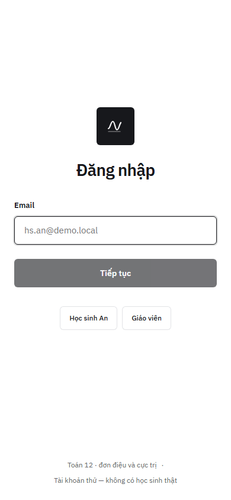
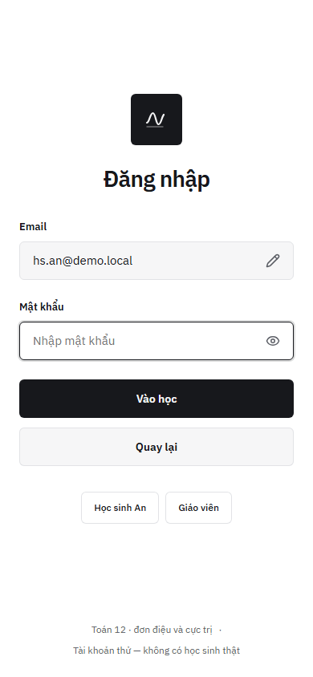
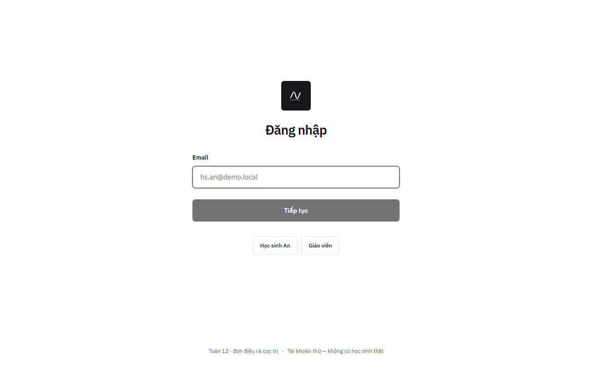

# Audit `/dang-nhap` v2 (Angular) so với `docs/DESIGN.md`

- **Ngày:** 2026-10-02 · **Trạng thái:** xong — 3 phát hiện mức thấp, không chặn #56
- **Đối tượng:** `apps/frontend/src/app/features/dang-nhap/`, port từ `apps/web/components/login-form.tsx` (v0)
- **Cách đo:** Playwright 1.63 (Chromium headless), `reducedMotion: reduce`, `ng serve` bản phát triển; đo bằng `getBoundingClientRect` sau `document.fonts.ready`.

## Ảnh

| 390 × 844, bước email | 390 × 844, bước mật khẩu | 1280 × 800, bước email |
| --- | --- | --- |
|  |  |  |

Viền màu quanh chữ trong ảnh là khử răng cưa LCD của Chromium trên Windows, không phải màu CSS.

## Số đo

| Thước (`docs/DESIGN.md`) | 390, email | 390, mật khẩu | 1280, email | Đạt |
| --- | --- | --- | --- | --- |
| Tâm khối chính ≈ 45–46 % chiều cao | 43,7 % | 45,6 % | 45,4 % | 2 / 3 |
| Không tràn ngang | không tràn | không tràn | không tràn | ✓ |
| Ô nhập cao 48 | 48 | 48 | 48 | ✓ |
| Nút chính cao 48 | 48 | 48 | 48 | ✓ |
| Nút phụ (chip) 40, chạm 44 khi `pointer: coarse` | 40 | 40 | 40 | ✓ (đo với chuột) |
| Font IBM Plex Sans, tự host | đã tải | đã tải | đã tải | ✓ |
| Tab `<trang> · Học toán với AI` | «Đăng nhập · Học toán với AI» | như trên | như trên | ✓ |

## Phát hiện

1. **Tâm khối 43,7 % ở 390 px, bước email (thấp).** Chân trang xuống hai dòng nên vùng chia 2 : 3 ngắn lại, khối lên cao hơn thước 45–46 %. Bố cục giống v0 (cùng hai khoảng dư `2 : 3`), nên khó là lỗi mới. Hướng sửa, chọn ở lab trước khi đổi `docs/DESIGN.md`:
   - (a) giữ nguyên;
   - (b) chân trang một dòng ở 390 px;
   - (c) đo tâm trên vùng trừ chân trang.
2. **Dấu «·» treo cuối dòng ở 390 px (thấp).** Chân trang xuống dòng nhưng dấu phân cách vẫn nằm cuối dòng một. Sửa: phân cách bằng `gap` / `::before` trên mục sau, hoặc tách hai dòng có chủ đích.
3. **«Tiếp tục» bị khóa khi ô trống (thấp).** Giữ như v0. Nút khóa không cho biết lý do; có thể để nút luôn bấm được và báo lỗi tại ô. Cần đối chiếu với audit a11y của v0 trước khi đổi.

## Việc tiếp

Phát hiện 1–2 gom vào issue thiết kế khi làm #57 (đăng nhập thật). Phát hiện 3 cần quyết định chung cho v0 và v2.
