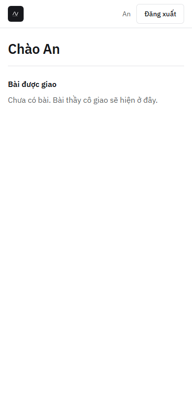
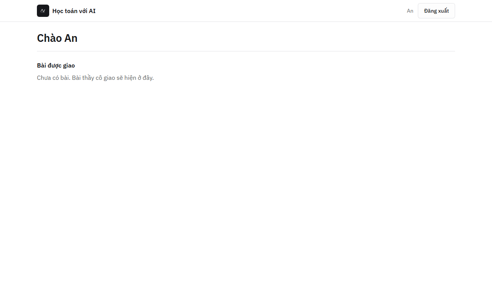
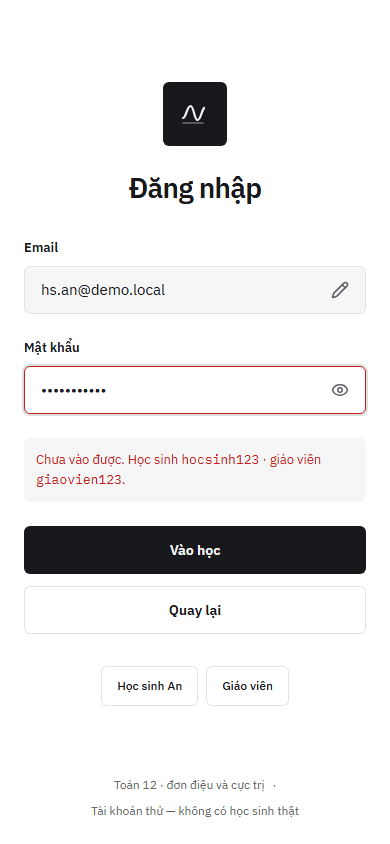
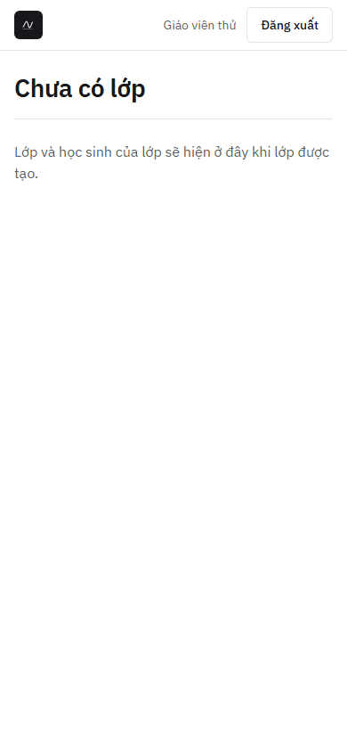
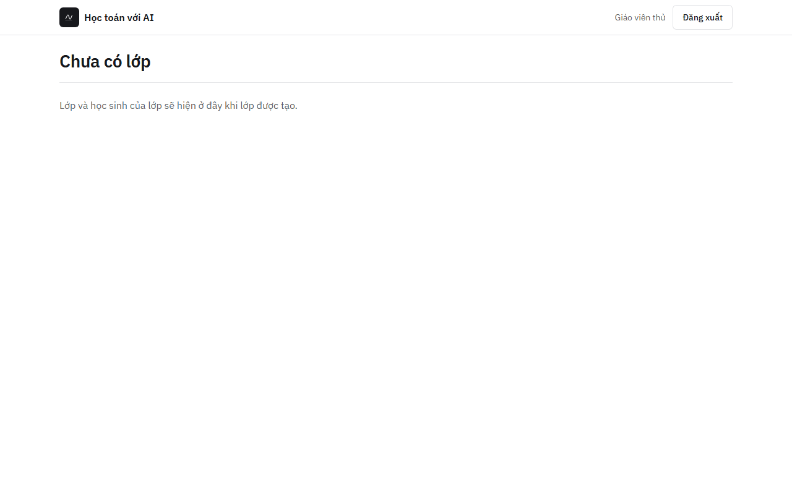

# Audit khung `/hs`, `/gv` v2 và lỗi đăng nhập so với `docs/DESIGN.md`

- **Ngày:** 2026-10-02 · **Trạng thái:** xong — 1 phát hiện đã sửa, 2 phát hiện mức thấp, không chặn #57
- **Đối tượng:** `apps/frontend/src/app/shared/layout/khung-trang.ts`, `features/hoc-sinh/`, `features/giao-vien/`, lỗi đăng nhập trong `features/dang-nhap/`
- **Cách đo:** Playwright 1.63 (Chromium headless) trên hệ compose v2 (nginx → core → PostgreSQL 18), tài khoản thử `hs.an@demo.local`, `gv@demo.local`; `reducedMotion: reduce`; đo bằng `getBoundingClientRect` sau `document.fonts.ready`. Ảnh do chính e2e `apps/frontend/e2e/dang-nhap.spec.ts` chụp.

## Ảnh

| 390 × 844, `/hs` | 1280 × 800, `/hs` | 390 × 844, sai mật khẩu |
| --- | --- | --- |
|  |  |  |

| 390 × 844, `/gv` | 1280 × 800, `/gv` |
| --- | --- |
|  |  |

## Số đo

| Thước | `/hs` 390 | `/hs` 1280 | `/gv` 390 | `/gv` 1280 | Đạt |
| --- | --- | --- | --- | --- | --- |
| Không tràn ngang | không tràn | không tràn | không tràn | không tràn | ✓ |
| Nút «Đăng xuất» cao 40 (chạm 44 khi `pointer: coarse`, theo `.btn`) | 40 | 40 | 40 | 40 | ✓ |
| Dấu sản phẩm thẳng hàng với heading (x) | 16 = 16 | 96 = 96 | 16 = 16 | 96 = 96 | ✓ (sau khi sửa) |
| Heading 28 px, đậm 600, như v0 (`text-[1.75rem] font-semibold`) | 28 | 28 | 28 | 28 | ✓ |
| IBM Plex Sans tự host đã tải | có | có | có | có | ✓ |
| Tab theo v0 (`/hs` «Học», `/gv` «Lớp») | «Học · Học toán với AI» | như trên | «Lớp · Học toán với AI» | như trên | ✓ |
| Thanh trên | 57 | 57 | 57 | 57 | xem phát hiện 2 |

## Phát hiện

1. **Đã sửa — dấu sản phẩm lệch heading ở 1280 px.** Thanh trên đệm 32 px từ mép màn, còn nội dung là cột 72rem ở giữa, nên dấu sản phẩm ở x = 32 mà heading ở x = 96. Thanh trên vẫn trải hết bề ngang nhưng đệm theo cột: `max(32px, (100% − 72rem) / 2 + 32px)`. Sau sửa hai bên cùng x = 96.
2. **Thấp — thanh trên cao 57 px.** Nút 40 + đệm 2 × 8 = 56, cộng viền dưới 1 px. Lệch lưới 8 px đúng bằng viền; giữ nguyên, như viền ô nhập.
3. **Thấp — lỗi đăng nhập lộ mật khẩu thử như v0.** Chỉ hiện khi email là `@demo.local` (tài khoản tổng hợp); email khác chỉ có «Chưa vào được. Kiểm tra lại email và mật khẩu.» Trước pilot nên ẩn cả khối tài khoản thử sau một cờ chế độ demo (ADR 012: chưa có học sinh thật khi chưa có đồng ý).

## Truy cập

- Mỗi trang một `<main id="noi-dung">`, có skip link «Bỏ qua đến nội dung»; heading `h1` duy nhất.
- Lỗi đăng nhập `role="alert"`, ô mật khẩu `aria-invalid` + `aria-describedby="loi-dang-nhap"`; nút «Vào học» `aria-busy` khi đang gửi.
- Dưới 480 px tên sản phẩm chỉ còn cho trình đọc màn hình (ẩn bằng `clip-path`), dấu sản phẩm vẫn hiện.
