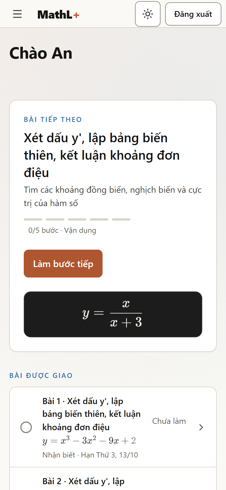
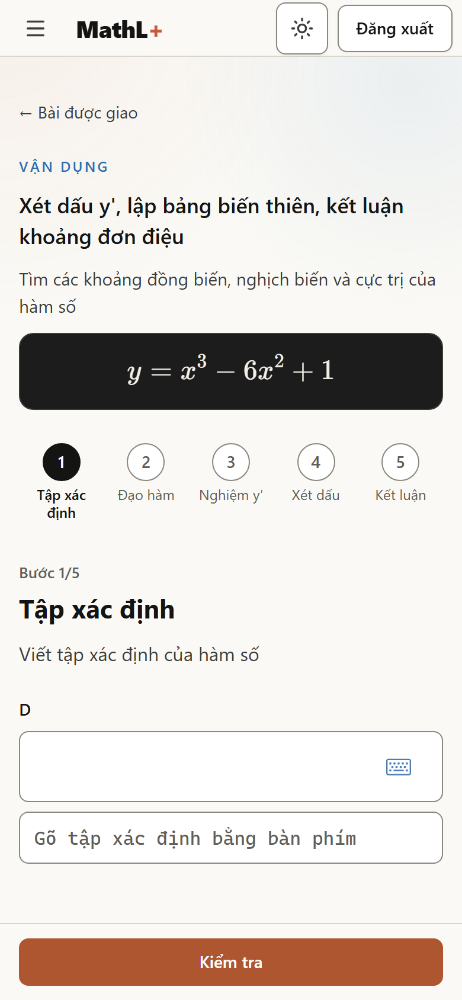
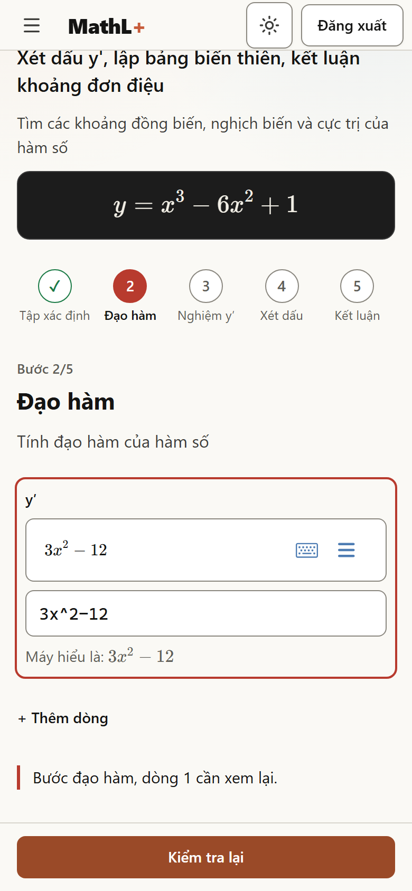
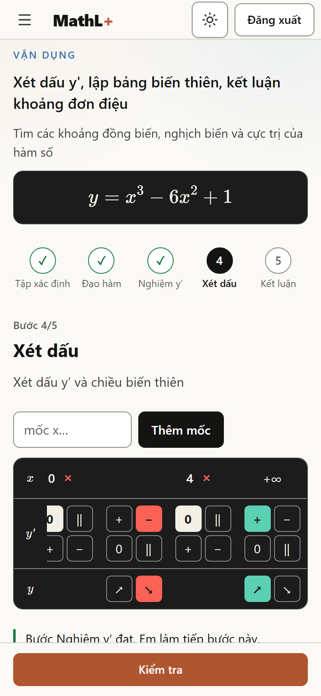
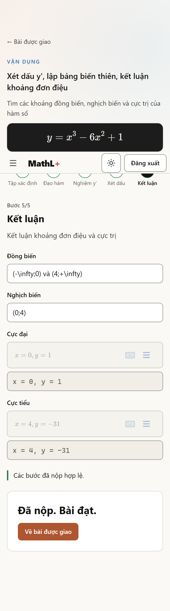
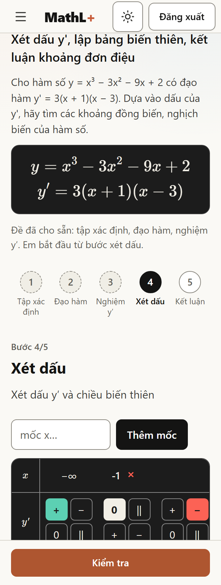
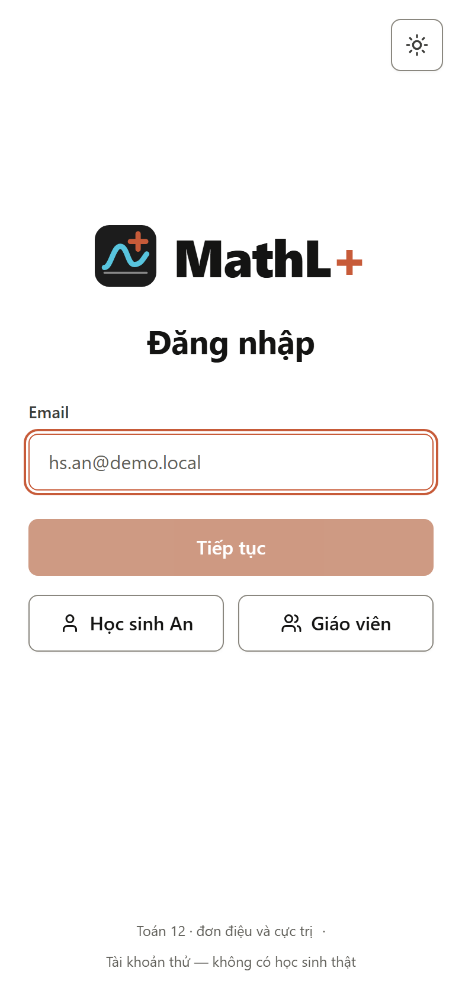
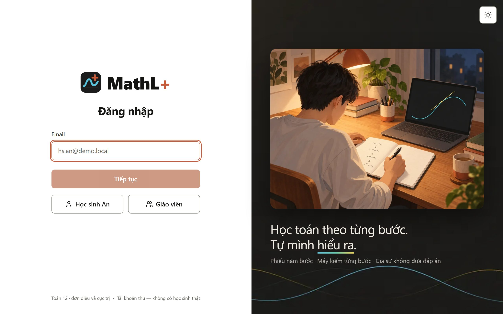
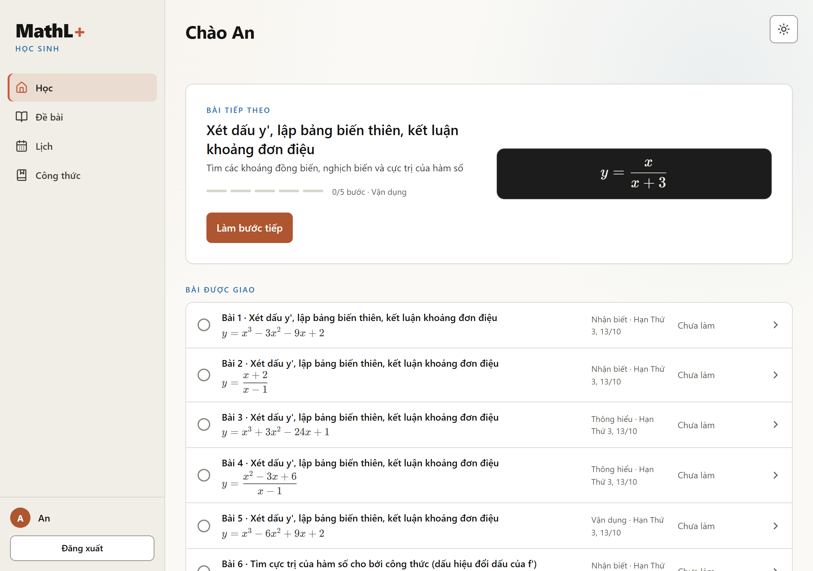
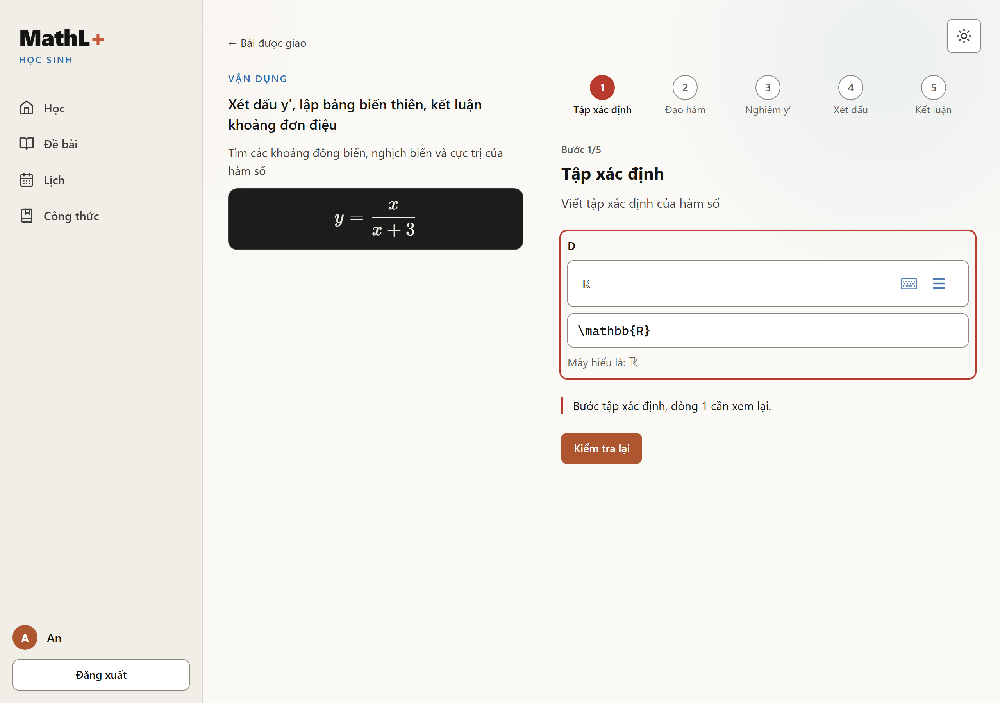

# Audit màn Luyện bài và trang Học với API thật (T021)

- **Ngày:** 2026-10-06 · **Trạng thái:** xong. 4 phát hiện, đã sửa cả 4 trước PR.
- **Đối tượng:** `apps/frontend/src/app/features/hoc-sinh/` (`trang-hoc-sinh`, `hang-bai`, `luyen/`).
- **Cách đo:** Playwright (Chromium headless, `deviceScaleFactor: 2`) qua `ng serve` → core của PR #148 (profile `dev`, PostgreSQL 18, dịch vụ toán thật). Dữ liệu là bài giao bằng `du-lieu-thu/giao-bai.sql`; không dữ liệu mẫu ở máy khách. Tài khoản thử `hs.an@demo.local`, `hs.binh@demo.local`. Core dựng từ `6829b71` (`docker compose -f compose.v2.yaml up --build --wait db math core`, cổng math dời sang 8001 vì v0 giữ 8000). Phần chạy lại được: `E2E_BASE_URL=http://127.0.0.1:4200 pnpm --filter frontend exec playwright test e2e/luyen.spec.ts` → 4/4 qua (390 + 1280).

## Một vòng đời bài, máy chấm thật

Bình làm `GEN-bac_ba-11` (y = x³ − 6x² + 1). Từng lần «Kiểm tra» là một `POST /api/hs/bai/GEN-bac_ba-11/buoc`, câu trả lời lấy nguyên từ core:

| Bước | Em gửi | Core trả |
| --- | --- | --- |
| Tập xác định | `\mathbb{R}` | `DAT` |
| Đạo hàm | `3x^2-12` (sai) | `SAI`, «Bước đạo hàm, dòng 1 cần xem lại.», `oSai` dòng 0, `ERR.DH.01` |
| Đạo hàm | `3x^2-12x` | `DAT` |
| Nghiệm y′ | `0`, `4` | `DAT` |
| Xét dấu | mốc 0, 4; + 0 − 0 +; ↗ ↘ ↗ | `DAT` |
| Kết luận | (−∞;0) và (4;+∞), (0;4), x = 0, y = 1, x = 4, y = −31 | `DAT` |
| Nộp bài | | `200 {"ketQua":"DAT","mucHieu":[]}` |

`mucHieu` rỗng vì core chưa tính mức hiểu (việc sau T021).

## Ảnh

| 390, trang Học | 390, bước 1 | 390, đạo hàm sai |
| --- | --- | --- |
|  |  |  |

| 390, xét dấu | 390, đã nộp | 320, bài khung ngắn |
| --- | --- | --- |
|  |  |  |

| 390, đăng nhập | 1280, đăng nhập |
| --- | --- |
|  |  |

| 1280, trang Học | 1280, Luyện (bước sai đã lưu, tải lại vẫn còn) |
| --- | --- |
|  |  |

## Phát hiện (đã sửa)

1. **Bảng xét dấu đẩy cả trang tràn ngang ở 390 px.** `app-bang-xet-dau` là mục lưới, `min-width: auto` lấy bề rộng của bảng. Sửa: `:host { min-width: 0 }`, bảng cuộn trong `.cuon`. Đo `scrollWidth − clientWidth` = 0 ở 320, 390, 1280; e2e `luyen.spec.ts` giữ số này.
2. **Câu chấm sai nằm dưới thanh «Kiểm tra» dính đáy.** Em bấm mà không thấy gì đổi. Sửa: sau khi chấm mà không sang bước, cuộn vùng câu chấm vào màn hình, chừa `scroll-margin-bottom` cho thanh.
3. **Câu đề GEN hiện LaTeX thô** («hàm số y = x^{3} - 6 x^{2} + 1»). Sửa: `thanDe` bỏ công thức cuối câu (đã vẽ trên bảng), giữ nguyên đề có công thức giữa câu; `hamLatex` thêm «y =» như v0.
4. **Công thức đề dài tràn ngang trên bảng** (`y = …,\quad y' = …`). Sửa: `deBang` xuống dòng từng vế bằng `gathered`.

## Còn mở

- Ô đổi dấu y′ hiện đủ bốn nút trong mỗi ô (v0 UXT-10-b), nên bảng hai mốc trở lên phải cuộn ngang ở 390 px. Cột nhãn đứng yên. Gọn hơn thì cần một ô chọn mở ra, để vòng thiết kế sau.
- Đồ thị có cực trị sau khi nộp: cần core trả dữ liệu vẽ (máy khách không tính đáp án), chờ chủ repo chọn lúc hiện.
