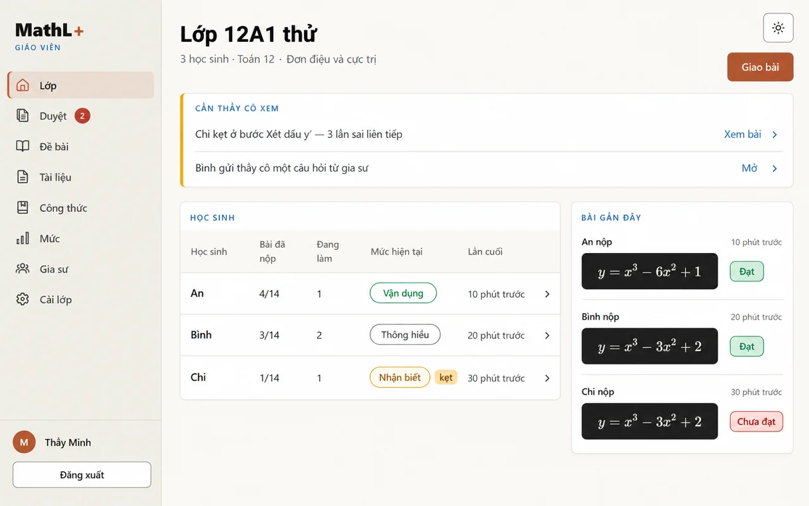
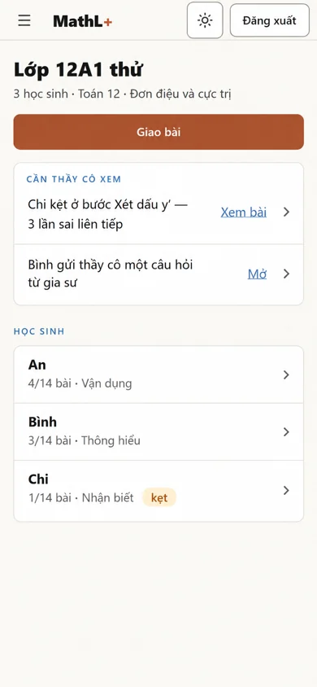
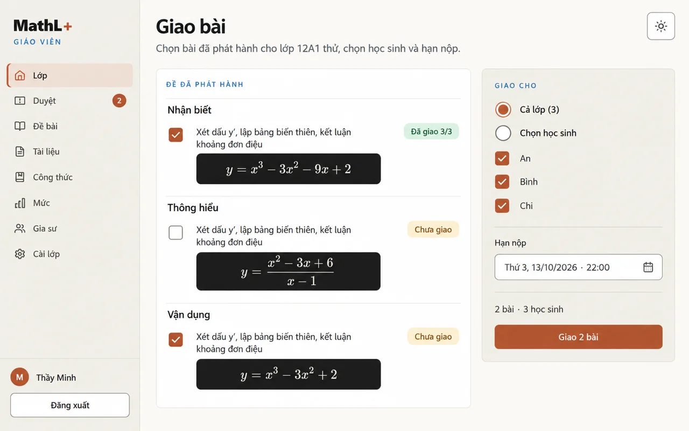
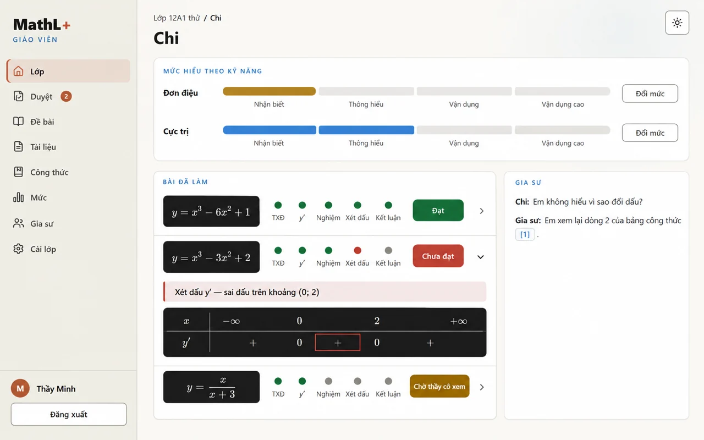
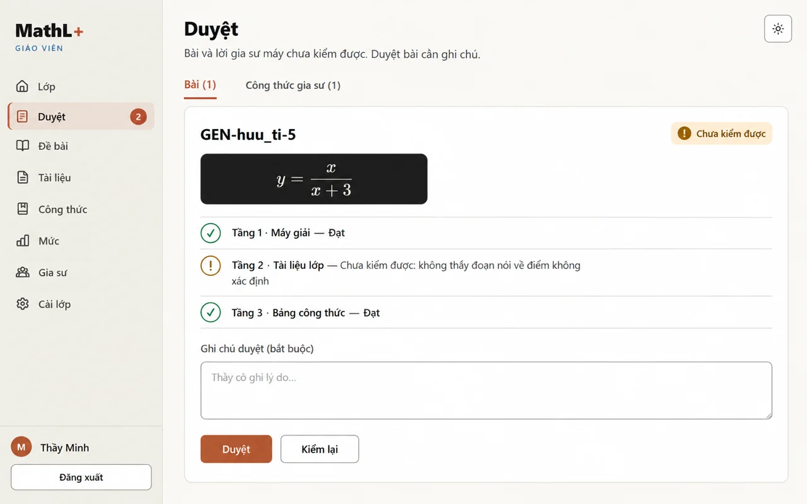
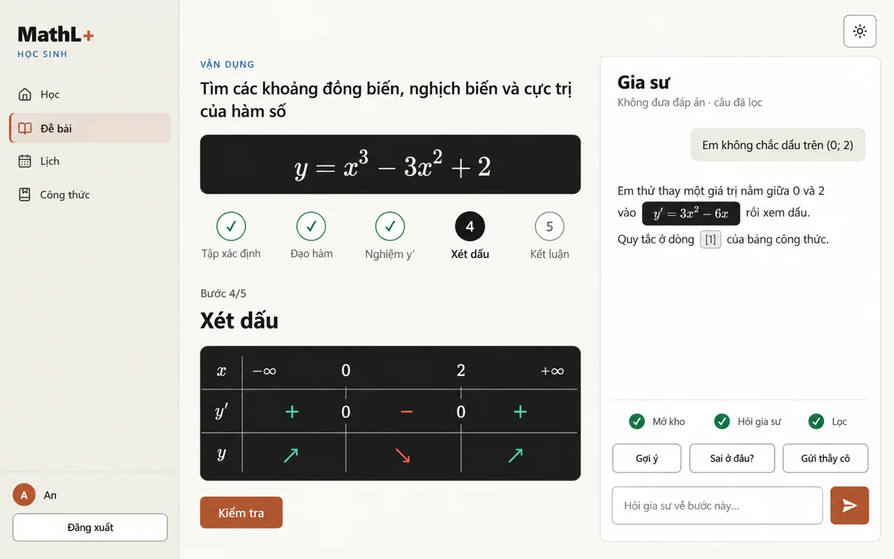
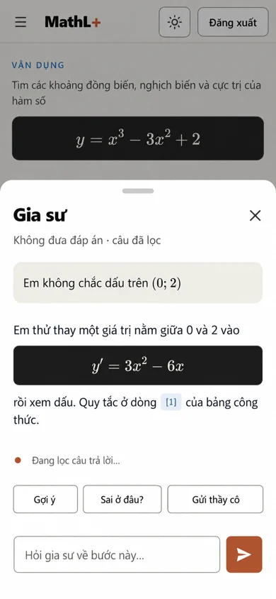

# Nguyên mẫu giáo viên và gia sư — 06/10/2026

Bảy ảnh theo một hướng giao diện MathL+ đang triển khai, dùng để chọn bố cục trước khi viết mã. Công cụ: **imagegen tích hợp** (`image_gen.imagegen`), tạo PNG dựa trên ba ảnh chụp ứng dụng do chủ repo cung cấp. Xuất bằng **Pillow 12.0.0**: chuyển RGB, resize **toàn khung** bằng `Image.Resampling.BICUBIC` về đúng canvas, rồi lưu WebP với `quality=86`, `method=6`; không cắt hoặc vẽ lại ảnh.

Tổng dung lượng **7 PNG được chọn trước khi xuất: 7.195.370 byte**; tổng **7 WebP sau khi xuất: 258.968 byte** (giảm 96,40 %). Các bản sinh lại không tính vào tổng này. Thư mục bàn giao chỉ giữ bảy WebP và README này; PNG gốc nằm ở thư mục đầu ra của imagegen.

Đã xem từng ảnh sinh ra và từng WebP cuối, kiểm tra chữ Việt, tên An / Bình / Chi, lớp «12A1 thử», wordmark «MathL+» và công thức. «Thầy Minh» là tên giáo viên trong brief. Riêng dấu **+** được viền đỏ trong bảng của Chi là lỗi học sinh được yêu cầu minh họa; dấu đúng trên khoảng (0; 2) là **−**. Với hàm y = x³ − 3x² + 2: y′ = 3x² − 6x, hai điểm tới hạn x = 0 và x = 2, cực đại (0; 2), cực tiểu (2; −2).

Các prompt dưới đây là **nguyên văn prompt của lần sinh được chọn** cho từng ảnh, gồm hệ thị giác chung được lặp lại đầy đủ. Ba ảnh tham chiếu cùng được truyền qua `referenced_image_paths`: `luyen-1280.png`, `hs-1280.png`, `luyen-390-xet-dau.png` từ thư mục audit `2026-10-06-luyen` do chủ repo cung cấp. Không commit hoặc push.

## Chọn và ràng buộc khi hiện thực

- **Chọn:** cả bảy ảnh làm bố cục cho màn giáo viên (`/gv`, giao bài, học sinh, duyệt) và cột gia sư trên màn Luyện (cột phải ở màn rộng, tờ dưới chiếm 65 % ở điện thoại). Một hướng duy nhất vì hệ thị giác đã chốt ở #145, #146.
- **Lời gia sư trong ảnh chỉ để minh họa bố cục.** Câu «thay một giá trị … vào y′ = 3x² − 6x» chứa đạo hàm của chính bài. Theo ADR 013, biểu thức này chỉ được hiện khi là trích bài làm: trùng nguyên văn dòng học sinh đã nộp ở bước đạo hàm và câu trình bày nó là lời của học sinh («em đã viết …»). Còn lại cổng `kiem_loi_giang` bỏ, như mọi kết quả tính cụ thể.
- **Tên «Thầy Minh» là tên trong brief.** Màn thật hiện tên hiển thị của tài khoản giáo viên.
- **Mức, số bài, thời gian trong ảnh là ví dụ.** Màn thật đọc từ API (mastery, practice), không có số liệu cứng.

## gv-lop-1280.webp

Canvas: **1280 × 800 px**. Dung lượng: **44.752 byte**. PNG nguồn: 1586 × 992 px, 1.024.609 byte.



Prompt nguyên văn:

```text
Use case: ui-mockup. Create ONE high-fidelity screenshot of the implemented MathL+ Angular app, matching the supplied implemented student screenshots exactly. One established visual direction only.
VISUAL SYSTEM (mandatory):
Flat, straight-on app screenshot, edge to edge, no device frame, no browser chrome, no captions, no option letters, no mascot, no stock illustration, no logos except the text wordmark “MathL+” (bold 800, the “+” in terracotta #C75B39).
Light theme. Page #FAF9F5, sidebar/secondary panels #F0EEE6, cards #FFFFFF with 12 px radius and very soft shadow, hairlines #D8D5CD, control borders #8A877F, ink #141413, secondary ink #3D3D3A, muted #5F5E58, small uppercase section labels in blue #2C6FB0 with wide letter spacing, primary buttons terracotta #AE5630 with white text, secondary buttons white with #8A877F border, 8 px button radius, 40 px button height, 8 px spacing grid, generous whitespace.
Status colors: pass/đạt green #1A7A45, mark/sai red #B83B2E, wait/chờ amber #8A5A00.
EVERY math area (formulas, sign tables, plots) sits on its own dark chalkboard panel #1C1C1C with cream #F2EFE6 Computer-Modern / KaTeX serif math, Manim accents: blue #58C4DD curves, yellow #F4D345 points, teal #5CD0B3 positive, red #FC6255 negative. Math symbols appearing in prose labels may remain inline; actual expressions must be on dark boards.
UI font: clean system sans-serif with full Vietnamese diacritics. Math font only: KaTeX/Computer Modern serif. Match reference type scale: desktop 28 px bold h1, 16 px body, 12 px blue section labels; mobile 24 px h1, 16 px body.
Desktop: left sidebar 260 px, wordmark “MathL+” and a small blue uppercase role label under it (“GIÁO VIÊN” or “HỌC SINH”), thin line icons, active item has a pale terracotta fill and a 3 px left bar; bottom: round avatar initial + name + outlined “Đăng xuất” button. Theme toggle (sun icon) top right in a 44 px outlined square.
Mobile 390 px: top bar 64 px with menu icon, wordmark, sun toggle, “Đăng xuất”; no sidebar.
Vietnamese text must be letter-perfect, including stacked accents. Use ONLY synthetic student names An, Bình, Chi; teacher shell user is exactly “Thầy Minh” as requested. Class name exactly “12A1 thử”. Product wordmark only “MathL+”. No invented product copy.
Mathematical invariant when this function appears: y = x³ − 3x² + 2; y′ = 3x² − 6x; critical points 0 and 2; derivative signs +, −, +; local maximum (0; 2), local minimum (2; −2). Do not confuse this function with other displayed functions.
Reference images are visual-system references only, NOT screens to reproduce. Preserve their app shell, typography, whitespace, thin borders and dark formula boards. Render the requested new screen below.
TEACHER DESKTOP SHELL:
Canvas exactly 1280 × 800, landscape 8:5. Sidebar occupies x=0..260, full height. Wordmark at x=24,y=32, role “GIÁO VIÊN”. Navigation in this exact order: “Lớp”, “Duyệt” with small badge “2”, “Đề bài”, “Tài liệu”, “Công thức”, “Mức”, “Gia sư”, “Cài lớp”. Bottom avatar “M”, name “Thầy Minh”, full-width outlined “Đăng xuất”. Content begins x=292, has 32 px right margin. Sun toggle at x=1204,y=24. Consistent generous whitespace, no KPI tiles, no extra charts.
SCREEN: Teacher class home, sidebar “Lớp” active.
Header h1 “Lớp 12A1 thử”, subtitle “3 học sinh · Toán 12 · Đơn điệu và cực trị”. Primary button “Giao bài” right aligned below the sun toggle.
At y≈152 a full-width white warning card with subtle amber left accent, blue small heading “CẦN THẦY CÔ XEM”. Two clean rows:
“Chi kẹt ở bước Xét dấu y′ — 3 lần sai liên tiếp” with right link “Xem bài”.
“Bình gửi thầy cô một câu hỏi từ gia sư” with right link “Mở”.
Below, a 632 px wide student table card on the left and a 292 px wide recent-work card on the right, 24 px gap. Heading “HỌC SINH”. Columns exactly “Học sinh”, “Bài đã nộp”, “Đang làm”, “Mức hiện tại”, “Lần cuối”. Three rows only:
An | 4/14 | 1 | “Vận dụng” green outline pill | “10 phút trước” | chevron.
Bình | 3/14 | 2 | “Thông hiểu” neutral outline pill | “20 phút trước” | chevron.
Chi | 1/14 | 1 | “Nhận biết” amber pill with separate small amber tag “kẹt” | “30 phút trước” | chevron.
Keep every header legible; allow two-line headers and timestamps.
Right card blue heading “BÀI GẦN ĐÂY”, three vertically spaced items separated by hairlines:
“An nộp”, dark small board y = x³ − 6x² + 1, green “Đạt”, time “10 phút trước”.
“Bình nộp”, dark small board y = x³ − 3x² + 2, green “Đạt”, time “20 phút trước”.
“Chi nộp”, dark small board y = x³ − 3x² + 2, red “Chưa đạt”, time “30 phút trước”.
Use actual math superscripts, never raw LaTeX. Balanced airy lower whitespace like the reference. Render every specified word correctly.
```

## gv-lop-390.webp

Canvas: **390 × 844 px**. Dung lượng: **17.532 byte**. PNG nguồn: 853 × 1844 px, 934.226 byte.



Prompt nguyên văn:

```text
Use case: ui-mockup. Create ONE high-fidelity screenshot of the implemented MathL+ Angular app, matching the supplied implemented student screenshots exactly. One established visual direction only.
VISUAL SYSTEM (mandatory):
Flat, straight-on app screenshot, edge to edge, no device frame, no browser chrome, no captions, no option letters, no mascot, no stock illustration, no logos except the text wordmark “MathL+” (bold 800, the “+” in terracotta #C75B39).
Light theme. Page #FAF9F5, sidebar/secondary panels #F0EEE6, cards #FFFFFF with 12 px radius and very soft shadow, hairlines #D8D5CD, control borders #8A877F, ink #141413, secondary ink #3D3D3A, muted #5F5E58, small uppercase section labels in blue #2C6FB0 with wide letter spacing, primary buttons terracotta #AE5630 with white text, secondary buttons white with #8A877F border, 8 px button radius, 40 px button height, 8 px spacing grid, generous whitespace.
Status colors: pass/đạt green #1A7A45, mark/sai red #B83B2E, wait/chờ amber #8A5A00.
EVERY math area (formulas, sign tables, plots) sits on its own dark chalkboard panel #1C1C1C with cream #F2EFE6 Computer-Modern / KaTeX serif math, Manim accents: blue #58C4DD curves, yellow #F4D345 points, teal #5CD0B3 positive, red #FC6255 negative. Math symbols appearing in prose labels may remain inline; actual expressions must be on dark boards.
UI font: clean system sans-serif with full Vietnamese diacritics. Math font only: KaTeX/Computer Modern serif. Match reference type scale: desktop 28 px bold h1, 16 px body, 12 px blue section labels; mobile 24 px h1, 16 px body.
Desktop: left sidebar 260 px, wordmark “MathL+” and a small blue uppercase role label under it (“GIÁO VIÊN” or “HỌC SINH”), thin line icons, active item has a pale terracotta fill and a 3 px left bar; bottom: round avatar initial + name + outlined “Đăng xuất” button. Theme toggle (sun icon) top right in a 44 px outlined square.
Mobile 390 px: top bar 64 px with menu icon, wordmark, sun toggle, “Đăng xuất”; no sidebar.
Vietnamese text must be letter-perfect, including stacked accents. Use ONLY synthetic student names An, Bình, Chi; teacher shell user is exactly “Thầy Minh” as requested. Class name exactly “12A1 thử”. Product wordmark only “MathL+”. No invented product copy.
Mathematical invariant when this function appears: y = x³ − 3x² + 2; y′ = 3x² − 6x; critical points 0 and 2; derivative signs +, −, +; local maximum (0; 2), local minimum (2; −2). Do not confuse this function with other displayed functions.
Reference images are visual-system references only, NOT screens to reproduce. Preserve their app shell, typography, whitespace, thin borders and dark formula boards. Render the requested new screen below.
MOBILE SHELL:
Canvas exactly 390 × 844, portrait. Top bar is 64 px tall, with thin menu icon at left, wordmark “MathL+” around 104 px wide, small outlined sun toggle and compact outlined “Đăng xuất”. No sidebar. Content has 16 px horizontal margins. All important content fits the requested frame without clipping text; normal mobile app, no fake phone frame.
SCREEN: Mobile version of the same teacher class home.
Below top bar, h1 “Lớp 12A1 thử”, subtitle “3 học sinh · Toán 12 · Đơn điệu và cực trị”, wrap naturally over two lines. Full-width primary “Giao bài”.
White warning card blue uppercase heading “CẦN THẦY CÔ XEM”. Two rows with exact text and correct accents, wrapping naturally:
“Chi kẹt ở bước Xét dấu y′ — 3 lần sai liên tiếp”; link “Xem bài”.
“Bình gửi thầy cô một câu hỏi từ gia sư”; link “Mở”.
Next heading “HỌC SINH”. One white card of three stacked list rows:
Bold “An”, secondary “4/14 bài · Vận dụng”, chevron.
Bold “Bình”, secondary “3/14 bài · Thông hiểu”, chevron.
Bold “Chi”, secondary “1/14 bài · Nhận biết”, small amber “kẹt” tag, chevron.
Use the full mobile type scale: 16 px body, 24 px bold h1, 12 px section labels, 40 px button height; do not miniaturize text to fit extra content.
Only the header, full-width Giao bài action, warning card, and all three student rows are visible in this viewport. Recent activity lies below this viewport and is not shown. Give warning copy natural multi-line wrapping and 80 px student rows. Top bar must be exactly64 px of the final390 ×844 frame; at least44 px icon/button touch height. The three students fit fully with generous bottom whitespace. No bottom nav, no duplicate header, no other names.
```

## gv-giao-bai-1280.webp

Canvas: **1280 × 800 px**. Dung lượng: **50.026 byte**. PNG nguồn: 1586 × 992 px, 1.098.240 byte.



Prompt nguyên văn:

```text
Use case: ui-mockup. Create ONE high-fidelity screenshot of the implemented MathL+ Angular app, matching the supplied implemented student screenshots exactly. One established visual direction only.
VISUAL SYSTEM (mandatory):
Flat, straight-on app screenshot, edge to edge, no device frame, no browser chrome, no captions, no option letters, no mascot, no stock illustration, no logos except the text wordmark “MathL+” (bold 800, the “+” in terracotta #C75B39).
Light theme. Page #FAF9F5, sidebar/secondary panels #F0EEE6, cards #FFFFFF with 12 px radius and very soft shadow, hairlines #D8D5CD, control borders #8A877F, ink #141413, secondary ink #3D3D3A, muted #5F5E58, small uppercase section labels in blue #2C6FB0 with wide letter spacing, primary buttons terracotta #AE5630 with white text, secondary buttons white with #8A877F border, 8 px button radius, 40 px button height, 8 px spacing grid, generous whitespace.
Status colors: pass/đạt green #1A7A45, mark/sai red #B83B2E, wait/chờ amber #8A5A00.
EVERY math area (formulas, sign tables, plots) sits on its own dark chalkboard panel #1C1C1C with cream #F2EFE6 Computer-Modern / KaTeX serif math, Manim accents: blue #58C4DD curves, yellow #F4D345 points, teal #5CD0B3 positive, red #FC6255 negative. Math symbols appearing in prose labels may remain inline; actual expressions must be on dark boards.
UI font: clean system sans-serif with full Vietnamese diacritics. Math font only: KaTeX/Computer Modern serif. Match reference type scale: desktop 28 px bold h1, 16 px body, 12 px blue section labels; mobile 24 px h1, 16 px body.
Desktop: left sidebar 260 px, wordmark “MathL+” and a small blue uppercase role label under it (“GIÁO VIÊN” or “HỌC SINH”), thin line icons, active item has a pale terracotta fill and a 3 px left bar; bottom: round avatar initial + name + outlined “Đăng xuất” button. Theme toggle (sun icon) top right in a 44 px outlined square.
Mobile 390 px: top bar 64 px with menu icon, wordmark, sun toggle, “Đăng xuất”; no sidebar.
Vietnamese text must be letter-perfect, including stacked accents. Use ONLY synthetic student names An, Bình, Chi; teacher shell user is exactly “Thầy Minh” as requested. Class name exactly “12A1 thử”. Product wordmark only “MathL+”. No invented product copy.
Mathematical invariant when this function appears: y = x³ − 3x² + 2; y′ = 3x² − 6x; critical points 0 and 2; derivative signs +, −, +; local maximum (0; 2), local minimum (2; −2). Do not confuse this function with other displayed functions.
Reference images are visual-system references only, NOT screens to reproduce. Preserve their app shell, typography, whitespace, thin borders and dark formula boards. Render the requested new screen below.
TEACHER DESKTOP SHELL:
Canvas exactly 1280 × 800, landscape 8:5. Sidebar occupies x=0..260, full height. Wordmark at x=24,y=32, role “GIÁO VIÊN”. Navigation in this exact order: “Lớp”, “Duyệt” with small badge “2”, “Đề bài”, “Tài liệu”, “Công thức”, “Mức”, “Gia sư”, “Cài lớp”. Bottom avatar “M”, name “Thầy Minh”, full-width outlined “Đăng xuất”. Content begins x=292, has 32 px right margin. Sun toggle at x=1204,y=24. Consistent generous whitespace, no KPI tiles, no extra charts.
SCREEN: Assign published exercises, sidebar “Lớp” active.
h1 “Giao bài”. Subtitle exactly “Chọn bài đã phát hành cho lớp 12A1 thử, chọn học sinh và hạn nộp.”
Two columns starting y≈152: left list card width≈608, right sticky settings panel width≈320, gap24. Left card blue heading “ĐỀ ĐÃ PHÁT HÀNH”. Three groups with headings “Nhận biết”, “Thông hiểu”, “Vận dụng”. Each has one exercise row: checkbox left, exact skill name “Xét dấu y′, lập bảng biến thiên, kết luận khoảng đơn điệu” over two lines, a small separate dark formula board below, and compact status tag.
Nhận biết row: checkbox CHECKED; formula y = x³ − 3x² − 9x + 2; tag “Đã giao 3/3”.
Thông hiểu row: checkbox unchecked; formula y = (x² − 3x + 6)/(x − 1) as a stacked fraction; tag “Chưa giao”.
Vận dụng row: checkbox CHECKED; formula y = x³ − 3x² + 2; tag “Chưa giao”.
Make dark chips wide enough for full formulas, no raw slash for fractions, no maths on white.
Right panel pale secondary background #F0EEE6 and heading “GIAO CHO”. Two radios: selected “Cả lớp (3)”, unselected “Chọn học sinh”. Below, three checked checkboxes with names “An”, “Bình”, “Chi”. Divider. Field label “Hạn nộp”, outlined date field displaying EXACTLY “Thứ 3, 13/10/2026 · 22:00”; can use two lines to keep date readable. Small calendar icon.
Summary “2 bài · 3 học sinh”. Full-width terracotta button “Giao 2 bài”.
Everything clean, balanced, within canvas. No duplicate actions, no extra text.
```

## gv-hoc-sinh-1280.webp

Canvas: **1280 × 800 px**. Dung lượng: **42.960 byte**. PNG nguồn: 1586 × 992 px, 1.032.507 byte.



Prompt nguyên văn:

```text
Use case: ui-mockup. Create ONE high-fidelity screenshot of the implemented MathL+ Angular app, matching the supplied implemented student screenshots exactly. One established visual direction only.
VISUAL SYSTEM (mandatory):
Flat, straight-on app screenshot, edge to edge, no device frame, no browser chrome, no captions, no option letters, no mascot, no stock illustration, no logos except the text wordmark “MathL+” (bold 800, the “+” in terracotta #C75B39).
Light theme. Page #FAF9F5, sidebar/secondary panels #F0EEE6, cards #FFFFFF with 12 px radius and very soft shadow, hairlines #D8D5CD, control borders #8A877F, ink #141413, secondary ink #3D3D3A, muted #5F5E58, small uppercase section labels in blue #2C6FB0 with wide letter spacing, primary buttons terracotta #AE5630 with white text, secondary buttons white with #8A877F border, 8 px button radius, 40 px button height, 8 px spacing grid, generous whitespace.
Status colors: pass/đạt green #1A7A45, mark/sai red #B83B2E, wait/chờ amber #8A5A00.
EVERY math area (formulas, sign tables, plots) sits on its own dark chalkboard panel #1C1C1C with cream #F2EFE6 Computer-Modern / KaTeX serif math, Manim accents: blue #58C4DD curves, yellow #F4D345 points, teal #5CD0B3 positive, red #FC6255 negative. Math symbols appearing in prose labels may remain inline; actual expressions must be on dark boards.
UI font: clean system sans-serif with full Vietnamese diacritics. Math font only: KaTeX/Computer Modern serif. Match reference type scale: desktop 28 px bold h1, 16 px body, 12 px blue section labels; mobile 24 px h1, 16 px body.
Desktop: left sidebar 260 px, wordmark “MathL+” and a small blue uppercase role label under it (“GIÁO VIÊN” or “HỌC SINH”), thin line icons, active item has a pale terracotta fill and a 3 px left bar; bottom: round avatar initial + name + outlined “Đăng xuất” button. Theme toggle (sun icon) top right in a 44 px outlined square.
Mobile 390 px: top bar 64 px with menu icon, wordmark, sun toggle, “Đăng xuất”; no sidebar.
Vietnamese text must be letter-perfect, including stacked accents. Use ONLY synthetic student names An, Bình, Chi; teacher shell user is exactly “Thầy Minh” as requested. Class name exactly “12A1 thử”. Product wordmark only “MathL+”. No invented product copy.
Mathematical invariant when this function appears: y = x³ − 3x² + 2; y′ = 3x² − 6x; critical points 0 and 2; derivative signs +, −, +; local maximum (0; 2), local minimum (2; −2). Do not confuse this function with other displayed functions.
Reference images are visual-system references only, NOT screens to reproduce. Preserve their app shell, typography, whitespace, thin borders and dark formula boards. Render the requested new screen below.
TEACHER DESKTOP SHELL:
Canvas exactly 1280 × 800, landscape 8:5. Sidebar occupies x=0..260, full height. Wordmark at x=24,y=32, role “GIÁO VIÊN”. Navigation in this exact order: “Lớp”, “Duyệt” with small badge “2”, “Đề bài”, “Tài liệu”, “Công thức”, “Mức”, “Gia sư”, “Cài lớp”. Bottom avatar “M”, name “Thầy Minh”, full-width outlined “Đăng xuất”. Content begins x=292, has 32 px right margin. Sun toggle at x=1204,y=24. Consistent generous whitespace, no KPI tiles, no extra charts.
SCREEN: Teacher student detail for Chi, sidebar “Lớp” active.
Breadcrumb exactly “Lớp 12A1 thử / Chi”. h1 “Chi”.
Full-width skill-level white strip headed “Mức hiểu theo kỹ năng”. Two rows labelled “Đơn điệu” and “Cực trị”. Each has a four-segment progress bar with labels EXACTLY “Nhận biết”, “Thông hiểu”, “Vận dụng”, “Vận dụng cao”, and small outlined “Đổi mức” at the right. First row filled only to Nhận biết (amber), second filled through Thông hiểu (blue). Equal segments and readable labels, no other scale.
Below, left work card width≈624 and right tutor-log card width≈304, 24 px gap. Left card heading “BÀI ĐÃ LÀM”.
Three exercise rows, each contains its own small dark formula chip and five small step status dots; labels EXACTLY under each set of dots: “TXĐ · y′ · Nghiệm · Xét dấu · Kết luận”. Do not add a sixth dot.
First row dark formula y = x³ − 6x² + 1, dots all green, pill “Đạt”.
Second row dark formula y = x³ − 3x² + 2, dots green, green, green, red, grey; pill “Chưa đạt”. This row is expanded.
Expanded failed-step text EXACTLY “Xét dấu y′ — sai dấu trên khoảng (0; 2)”.
Under it, student's small dark sign-table board: x row correctly spaced “−∞”, “0”, “2”, “+∞”; y′ interval signs +, +, + with zero at 0 and at 2. The central interval sign + is DELIBERATELY the student's error and MUST be enclosed in a red outline rectangle; this is the only intentional wrong math in the screen, explicitly identified as the failed student's input. Correct mathematical ground truth outside this error is +, −, +. Keep boundary columns and interval columns mathematically aligned.
Third row dark fraction y = x/(x + 3), dots green, green, grey, grey, grey; pill “Chờ thầy cô xem” amber.
Right card blue heading “GIA SƯ”. Two short logged turns exactly:
“Chi: Em không hiểu vì sao đổi dấu?”
“Gia sư: Em xem lại dòng 2 của bảng công thức [1].”
Make [1] a small rounded citation badge. UI prose sans-serif; expressions serif on dark boards. All panels fit in 800 px height. Only synthetic student Chi is the detail subject.
STRICT FINAL LAYOUT AND TEXT CHECK:
Sidebar must occupy exactly20.3125% of the whole canvas width (260/1280), with content beginning at292/1280; match the sidebar geometry of the supplied implemented desktop screenshots. Final UI body text should be16 px and compact metadata12 px; do not shrink the entire screen's type. Omit extra long problem titles and extra helper captions that were not requested; compact exercise rows contain ONLY formula chip, five dots with labels, and result pill. Use small dots rather than large step circles to keep these rows readable.
Tutor log must show exact visible labels “Chi:” and “Gia sư:”, followed by exact sentences “Em không hiểu vì sao đổi dấu?” and “Em xem lại dòng 2 của bảng công thức [1].”. The final full stop after the [1] citation badge is REQUIRED. Tutor sentence is flush-left plain text, no blue assistant bubble. Do not add timestamps or other log copy.
Failed-step text must be exactly “Xét dấu y′ — sai dấu trên khoảng (0; 2)” including the space after the semicolon. The central + is the sole intentional student error, red outline only. Preserve all correct formulas and every Vietnamese accent.
```

## gv-duyet-1280.webp

Canvas: **1280 × 800 px**. Dung lượng: **36.334 byte**. PNG nguồn: 1586 × 992 px, 963.251 byte.



Prompt nguyên văn:

```text
Use case: ui-mockup. Create ONE high-fidelity screenshot of the implemented MathL+ Angular app, matching the supplied implemented student screenshots exactly. One established visual direction only.
VISUAL SYSTEM (mandatory):
Flat, straight-on app screenshot, edge to edge, no device frame, no browser chrome, no captions, no option letters, no mascot, no stock illustration, no logos except the text wordmark “MathL+” (bold 800, the “+” in terracotta #C75B39).
Light theme. Page #FAF9F5, sidebar/secondary panels #F0EEE6, cards #FFFFFF with 12 px radius and very soft shadow, hairlines #D8D5CD, control borders #8A877F, ink #141413, secondary ink #3D3D3A, muted #5F5E58, small uppercase section labels in blue #2C6FB0 with wide letter spacing, primary buttons terracotta #AE5630 with white text, secondary buttons white with #8A877F border, 8 px button radius, 40 px button height, 8 px spacing grid, generous whitespace.
Status colors: pass/đạt green #1A7A45, mark/sai red #B83B2E, wait/chờ amber #8A5A00.
EVERY math area (formulas, sign tables, plots) sits on its own dark chalkboard panel #1C1C1C with cream #F2EFE6 Computer-Modern / KaTeX serif math, Manim accents: blue #58C4DD curves, yellow #F4D345 points, teal #5CD0B3 positive, red #FC6255 negative. Math symbols appearing in prose labels may remain inline; actual expressions must be on dark boards.
UI font: clean system sans-serif with full Vietnamese diacritics. Math font only: KaTeX/Computer Modern serif. Match reference type scale: desktop 28 px bold h1, 16 px body, 12 px blue section labels; mobile 24 px h1, 16 px body.
Desktop: left sidebar 260 px, wordmark “MathL+” and a small blue uppercase role label under it (“GIÁO VIÊN” or “HỌC SINH”), thin line icons, active item has a pale terracotta fill and a 3 px left bar; bottom: round avatar initial + name + outlined “Đăng xuất” button. Theme toggle (sun icon) top right in a 44 px outlined square.
Mobile 390 px: top bar 64 px with menu icon, wordmark, sun toggle, “Đăng xuất”; no sidebar.
Vietnamese text must be letter-perfect, including stacked accents. Use ONLY synthetic student names An, Bình, Chi; teacher shell user is exactly “Thầy Minh” as requested. Class name exactly “12A1 thử”. Product wordmark only “MathL+”. No invented product copy.
Mathematical invariant when this function appears: y = x³ − 3x² + 2; y′ = 3x² − 6x; critical points 0 and 2; derivative signs +, −, +; local maximum (0; 2), local minimum (2; −2). Do not confuse this function with other displayed functions.
Reference images are visual-system references only, NOT screens to reproduce. Preserve their app shell, typography, whitespace, thin borders and dark formula boards. Render the requested new screen below.
TEACHER DESKTOP SHELL:
Canvas exactly 1280 × 800, landscape 8:5. Sidebar occupies x=0..260, full height. Wordmark at x=24,y=32, role “GIÁO VIÊN”. Navigation in this exact order: “Lớp”, “Duyệt” with small badge “2”, “Đề bài”, “Tài liệu”, “Công thức”, “Mức”, “Gia sư”, “Cài lớp”. Bottom avatar “M”, name “Thầy Minh”, full-width outlined “Đăng xuất”. Content begins x=292, has 32 px right margin. Sun toggle at x=1204,y=24. Consistent generous whitespace, no KPI tiles, no extra charts.
SCREEN: Teacher review queue, sidebar “Duyệt” active with badge “2”, “Lớp” inactive.
h1 “Duyệt”. Subtitle exactly “Bài và lời gia sư máy chưa kiểm được. Duyệt bài cần ghi chú.”
Tabs “Bài (1)” active with terracotta underline, “Công thức gia sư (1)” inactive.
One large white item card, width≈952, moderate padding24, at y≈192. Item title EXACTLY “GEN-huu_ti-5”, amber status pill “Chưa kiểm được” right aligned. Under title, a small dark math board with y = x/(x + 3) typeset as the proper stacked fraction, cream KaTeX style.
Three evidence rows separated by subtle hairlines, exact text:
“Tầng 1 · Máy giải — Đạt” with green status icon.
“Tầng 2 · Tài liệu lớp — Chưa kiểm được: không thấy đoạn nói về điểm không xác định” with amber status icon. Wrap on two lines if necessary, keep “xác định” correct.
“Tầng 3 · Bảng công thức — Đạt” with green status icon.
Below label “Ghi chú duyệt (bắt buộc)” above large outlined blank textarea with placeholder “Thầy cô ghi lý do…”. Placeholder muted, no actual filled note.
Bottom left buttons primary “Duyệt”, secondary “Kiểm lại”. Normal button heights40, radius8. Preserve broad negative space underneath, do not add other queue items or empty-state copy.
```

## luyen-gia-su-1280.webp

Canvas: **1280 × 800 px**. Dung lượng: **45.370 byte**. PNG nguồn: 1586 × 992 px, 1.075.944 byte.



Prompt nguyên văn:

```text
Use case: ui-mockup. Create ONE high-fidelity screenshot of the implemented MathL+ Angular app, matching the supplied implemented student screenshots exactly. One established visual direction only.
VISUAL SYSTEM (mandatory):
Flat, straight-on app screenshot, edge to edge, no device frame, no browser chrome, no captions, no option letters, no mascot, no stock illustration, no logos except the text wordmark “MathL+” (bold 800, the “+” in terracotta #C75B39).
Light theme. Page #FAF9F5, sidebar/secondary panels #F0EEE6, cards #FFFFFF with 12 px radius and very soft shadow, hairlines #D8D5CD, control borders #8A877F, ink #141413, secondary ink #3D3D3A, muted #5F5E58, small uppercase section labels in blue #2C6FB0 with wide letter spacing, primary buttons terracotta #AE5630 with white text, secondary buttons white with #8A877F border, 8 px button radius, 40 px button height, 8 px spacing grid, generous whitespace.
Status colors: pass/đạt green #1A7A45, mark/sai red #B83B2E, wait/chờ amber #8A5A00.
EVERY math area (formulas, sign tables, plots) sits on its own dark chalkboard panel #1C1C1C with cream #F2EFE6 Computer-Modern / KaTeX serif math, Manim accents: blue #58C4DD curves, yellow #F4D345 points, teal #5CD0B3 positive, red #FC6255 negative. Math symbols appearing in prose labels may remain inline; actual expressions must be on dark boards.
UI font: clean system sans-serif with full Vietnamese diacritics. Math font only: KaTeX/Computer Modern serif. Match reference type scale: desktop 28 px bold h1, 16 px body, 12 px blue section labels; mobile 24 px h1, 16 px body.
Desktop: left sidebar 260 px, wordmark “MathL+” and a small blue uppercase role label under it (“GIÁO VIÊN” or “HỌC SINH”), thin line icons, active item has a pale terracotta fill and a 3 px left bar; bottom: round avatar initial + name + outlined “Đăng xuất” button. Theme toggle (sun icon) top right in a 44 px outlined square.
Mobile 390 px: top bar 64 px with menu icon, wordmark, sun toggle, “Đăng xuất”; no sidebar.
Vietnamese text must be letter-perfect, including stacked accents. Use ONLY synthetic student names An, Bình, Chi; teacher shell user is exactly “Thầy Minh” as requested. Class name exactly “12A1 thử”. Product wordmark only “MathL+”. No invented product copy.
Mathematical invariant when this function appears: y = x³ − 3x² + 2; y′ = 3x² − 6x; critical points 0 and 2; derivative signs +, −, +; local maximum (0; 2), local minimum (2; −2). Do not confuse this function with other displayed functions.
Reference images are visual-system references only, NOT screens to reproduce. Preserve their app shell, typography, whitespace, thin borders and dark formula boards. Render the requested new screen below.
Canvas exactly 1280 × 800, landscape 8:5. STUDENT DESKTOP SHELL matches supplied screenshots: full-height 260 px sidebar #F0EEE6, wordmark “MathL+”, role “HỌC SINH”, thin-icon navigation “Học”, “Đề bài” active (pale terracotta fill and 3 px bar), “Lịch”, “Công thức”. Bottom avatar “A”, name “An”, outlined “Đăng xuất”. Sun toggle in top-right outlined44 square.
SCREEN: Practice with open tutor on right. Main practice column x≈292..864 (width≈572); tutor card x≈888..1248 (width360), top≈96, bottom≈768. One 24 px gutter. Do not reduce sidebar width.
Left top small blue uppercase “VẬN DỤNG”. Problem text exactly “Tìm các khoảng đồng biến, nghịch biến và cực trị của hàm số”, clean 18 px text over two lines. Separate dark chalkboard formula panel displaying y = x³ − 3x² + 2 in large cream Computer Modern math.
Below a five-step horizontal rail: first three green outlined circles with ✓, labelled “Tập xác định”, “Đạo hàm”, “Nghiệm y′”; fourth black circle “4”, labelled “Xét dấu” current; fifth outlined grey circle “5”, labelled “Kết luận”. Exactly five steps.
Heading “Bước 4/5”, below bold “Xét dấu”.
Dark sign-table board with perfectly aligned boundary and interval columns:
x row has −∞ at far left, 0 first critical boundary, 2 second critical boundary, +∞ at far right.
y′ row: + on (−∞;0), 0 at x=0, − on (0;2), 0 at x=2, + on (2;+∞).
y arrows row: ↗ on first interval, ↘ on central interval, ↗ on last interval. All three arrows aligned with their intervals. Teal positive signs/rising arrows, red negative sign/falling arrow, cream zeros. No extrema answers or point coordinates shown to student.
Terracotta “Kiểm tra” under the board.
Right open tutor is a white card with hairline border12 radius, title “Gia sư”, small grey caption EXACTLY “Không đưa đáp án · câu đã lọc”.
A pale-secondary student bubble containing EXACTLY “Em không chắc dấu trên (0; 2)”.
Below, tutor reply sans-serif, flush left:
“Em thử thay một giá trị nằm giữa 0 và 2 vào y′ = 3x² − 6x rồi xem dấu. Quy tắc ở dòng [1] của bảng công thức.”
Keep wording VERBATIM, splitting the actual formula y′ = 3x² − 6x into a small dark inline/inset math board within the reply; do not add a sign result. The “[1]” is a small rounded citation badge.
Status row with three small stages “Mở kho · Hỏi gia sư · Lọc”, all three done with green checks.
Then three compact chips “Gợi ý”, “Sai ở đâu?”, “Gửi thầy cô”; wrap if necessary without clipping.
Bottom pinned composer outlined field placeholder “Hỏi gia sư về bước này…” and a square44 send arrow icon button. Field placeholder may wrap to remain fully readable. Generous clean whitespace between conversation and composer. No extra messages.
FINAL GEOMETRY AND TEXT REQUIREMENTS:
Reserve exactly20.3125% of the whole width for the sidebar (260/1280), exactly28.125% for the tutor card (360/1280). Tutor left edge at888/1280, right edge1248/1280. Main practice starts292/1280 and ends864/1280. Use these proportions if rendering larger than1280. The tutor card must not grow wider.
Problem copy is regular18 px UI sans-serif, not a giant bold hero title. Tutor title is24 px. Tutor reply is plain text on the white card, flush-left, with no assistant bubble. Student bubble is #F0EEE6. The derivative formula appears ONCE in that reply, only in its dark inset board, between the prose “vào” and “rồi xem dấu.”. Do not duplicate formula on white. Citation [1] badge stays at the exact position in the sentence.
Student message exactly “Em không chắc dấu trên (0; 2)”, preserve the semicolon and following space. No extra text or extra reply. Controls have8 px radius, no pill-shaped buttons. The sign table must remain correct with +,0,−,0,+ and ↗,↘,↗.
```

## luyen-gia-su-390.webp

Canvas: **390 × 844 px**. Dung lượng: **21.994 byte**. PNG nguồn: 853 × 1844 px, 1.066.593 byte.



Prompt nguyên văn:

```text
Use case: ui-mockup. Create ONE high-fidelity screenshot of the implemented MathL+ Angular app, matching the supplied implemented student screenshots exactly. One established visual direction only.
VISUAL SYSTEM (mandatory):
Flat, straight-on app screenshot, edge to edge, no device frame, no browser chrome, no captions, no option letters, no mascot, no stock illustration, no logos except the text wordmark “MathL+” (bold 800, the “+” in terracotta #C75B39).
Light theme. Page #FAF9F5, sidebar/secondary panels #F0EEE6, cards #FFFFFF with 12 px radius and very soft shadow, hairlines #D8D5CD, control borders #8A877F, ink #141413, secondary ink #3D3D3A, muted #5F5E58, small uppercase section labels in blue #2C6FB0 with wide letter spacing, primary buttons terracotta #AE5630 with white text, secondary buttons white with #8A877F border, 8 px button radius, 40 px button height, 8 px spacing grid, generous whitespace.
Status colors: pass/đạt green #1A7A45, mark/sai red #B83B2E, wait/chờ amber #8A5A00.
EVERY math area (formulas, sign tables, plots) sits on its own dark chalkboard panel #1C1C1C with cream #F2EFE6 Computer-Modern / KaTeX serif math, Manim accents: blue #58C4DD curves, yellow #F4D345 points, teal #5CD0B3 positive, red #FC6255 negative. Math symbols appearing in prose labels may remain inline; actual expressions must be on dark boards.
UI font: clean system sans-serif with full Vietnamese diacritics. Math font only: KaTeX/Computer Modern serif. Match reference type scale: desktop 28 px bold h1, 16 px body, 12 px blue section labels; mobile 24 px h1, 16 px body.
Desktop: left sidebar 260 px, wordmark “MathL+” and a small blue uppercase role label under it (“GIÁO VIÊN” or “HỌC SINH”), thin line icons, active item has a pale terracotta fill and a 3 px left bar; bottom: round avatar initial + name + outlined “Đăng xuất” button. Theme toggle (sun icon) top right in a 44 px outlined square.
Mobile 390 px: top bar 64 px with menu icon, wordmark, sun toggle, “Đăng xuất”; no sidebar.
Vietnamese text must be letter-perfect, including stacked accents. Use ONLY synthetic student names An, Bình, Chi; teacher shell user is exactly “Thầy Minh” as requested. Class name exactly “12A1 thử”. Product wordmark only “MathL+”. No invented product copy.
Mathematical invariant when this function appears: y = x³ − 3x² + 2; y′ = 3x² − 6x; critical points 0 and 2; derivative signs +, −, +; local maximum (0; 2), local minimum (2; −2). Do not confuse this function with other displayed functions.
Reference images are visual-system references only, NOT screens to reproduce. Preserve their app shell, typography, whitespace, thin borders and dark formula boards. Render the requested new screen below.
MOBILE SHELL:
Canvas exactly 390 × 844, portrait. Top bar is 64 px tall, with thin menu icon at left, wordmark “MathL+” around 104 px wide, small outlined sun toggle and compact outlined “Đăng xuất”. No sidebar. Content has 16 px horizontal margins. All important content fits the requested frame without clipping text; normal mobile app, no fake phone frame.
SCREEN: Student practice with tutor open as a mobile bottom sheet covering exactly the lower approximately65% of the screen. The dimmed practice remains visible behind from y=64 to y≈295. Dimmed practice shows blue “VẬN DỤNG”, problem text “Tìm các khoảng đồng biến, nghịch biến và cực trị của hàm số” and dark formula board y = x³ − 3x² + 2. No invented student names.
Bottom sheet begins at y≈295 and ends at844. White sheet with subtle radius12 upper corners, small centered grey drag handle, header title “Gia sư” and close “×” in a44 px touch region. A small grey caption “Không đưa đáp án · câu đã lọc”.
Same conversation as desktop, readable16 px sans-serif:
Student bubble pale #F0EEE6: “Em không chắc dấu trên (0; 2)”.
Tutor text flush left, VERBATIM:
“Em thử thay một giá trị nằm giữa 0 và 2 vào y′ = 3x² − 6x rồi xem dấu. Quy tắc ở dòng [1] của bảng công thức.”
Actual formula y′ = 3x² − 6x must sit on its own small dark math board within this reply, cream KaTeX serif. The “[1]” must be a small rounded citation badge. No supplied sign result, no complete solution.
Live status line with small progress dot: “Đang lọc câu trả lời…”.
A single chips row with “Gợi ý”, “Sai ở đâu?”, “Gửi thầy cô”. Compact but readable.
Composer pinned at bottom above blank safe area: outlined text field with exact placeholder “Hỏi gia sư về bước này…” plus square send arrow icon44. No keyboard. Keep bottom safe area16 px.
All dialogue, status, chips and composer must be visible without text cut-off. Sheet only, no duplicate right panel, no mascot, no phone chrome.
FINAL TEXT AND GEOMETRY REQUIREMENTS:
The derivative y′ = 3x² − 6x appears ONLY ONCE inside the tutor reply, exclusively on its small dark chalkboard inset. Typeset the reply as these continuous verbatim parts: “Em thử thay một giá trị nằm giữa 0 và 2 vào”, then a small dark board displaying “y′ = 3x² − 6x”, then “rồi xem dấu. Quy tắc ở dòng [1] của bảng công thức.”. No second formula on a light surface and no duplicate formula beneath the reply. The sentence still reads exactly as specified.
Tutor reply is plain text on white, no assistant bubble. Student bubble is pale #F0EEE6. Use16 px body text at final390 ×844 size. Small status progress dot6 px, exact text “Đang lọc câu trả lời…”. Chips “Gợi ý”, “Sai ở đâu?”, “Gửi thầy cô” have8 px corner radius, simple compact outlined rectangular buttons, no big pictograms and no pill shapes.
Top bar64 px, sheet top at295 px (34.95% of full height) and bottom844 px, with16 px safe area. Caption and replies legible, pinned composer fully visible. Student message exactly “Em không chắc dấu trên (0; 2)” with correct semicolon spacing. All text has exact Vietnamese accents.
CRITICAL BOTTOM-SHEET COMPOSITION:
The white bottom sheet MUST start at35% of the full image height and therefore occupy65% of the screen. Make the sheet taller than in a half-screen modal. Its top edge is at final y=295, not360 or400.
The dimmed background ABOVE the sheet contains ONLY the64 px top bar, small blue “VẬN DỤNG”, the regular16 px text “Tìm các khoảng đồng biến, nghịch biến và cực trị của hàm số” wrapping to two lines, and a compact dark formula board y = x³ − 3x² + 2. Do NOT show the extra long skill title “Xét dấu y′, lập bảng biến thiên, kết luận khoảng đơn điệu”. Do NOT show any step rail, numbered circles, step labels, sign table or extra controls above the sheet. Removing these background elements gives the bottom sheet its required65% height.
Sheet content ordering: drag handle; Gia sư and ×; caption; student bubble; plain tutor reply with ONE derivative inset on dark; live status; rectangular three-chip row; composer pinned above16 px safe area. Keep every word and formula exactly as in the preceding specification.
```
